# FuelUp Youth — Admin Module Architecture & Design

**Version:** 0.1 (Design — for review)
**Date:** 2026-06-22
**Status:** Awaiting design approval (no implementation until approved)
**Authors:** Principal Engineer / Product Architect / Security Architect / Senior UX
**Source of truth for current system:** [`docs/HLD.md`](HLD.md) v1.3

> Scope note: This document is a **design only**. Per the engagement rules it contains no
> implementation code, no migrations, no frontend/backend source. After approval, a separate
> implementation plan will be produced (backend / frontend / DB / APIs / testing / rollout /
> AI-agent execution / acceptance criteria).

---

## 1. Executive Summary

### What is being built
An **Admin Module** for FuelUp Youth (branded *Fueling2Win*): an internal-only console plus a small
set of protected `/api/admin/*` endpoints that give the founding team operational visibility and
support capabilities over the live product. It is delivered in phases:

- **Phase 1 — User Administration (Priority 1):** see every parent, athlete, and their links;
  spot broken onboarding; resend invites; safely deactivate/reactivate accounts; everything
  audit-logged.
- **Phase 2 — Product Analytics (Priority 2):** lightweight event capture answering *who signed
  up, who finished onboarding, what gets used, what AI questions are asked, who returns, where
  people drop off* — plus an **AI Usage Analytics** view built on the already-shipped
  `coach_feedback` telemetry.
- **Phase 3 — Future Expansion:** additional roles (coach, dietitian, support/nutrition admin),
  MFA, soft-delete tooling, richer reporting.

### Why it is needed
The MVP product is functional but the team is **flying blind operationally**. There is no way to
answer "how many families signed up this week," "which athletes are stuck in onboarding," "is the
AI coach being asked the same five questions," or "this parent emailed support — what's their
account state?" Today those answers require SSHing into the Fly.io VM and running raw SQLite
queries. That doesn't scale past a handful of users and is error-prone and unauditable.

### MVP objectives
1. Replace ad-hoc SQL-over-SSH with a **safe, read-mostly admin console**.
2. Make **parent↔athlete relationship health** visible (the #1 onboarding failure mode).
3. Provide **two or three safe write actions** (resend invite, deactivate, reactivate) — every one
   audit-logged.
4. Stand up an **additive analytics spine** without a warehouse or third-party BI tool.
5. Surface **AI usage insights** from existing `coach_feedback` data plus a thin prompt log.

### Long-term vision
A role-based internal platform: support staff triage accounts; a dietitian reviews flagged AI
interactions; a founder reads a daily email digest; product reads funnels and retention. The MVP
deliberately builds the **seams** for that (a `role` column, an audit log, an event table) without
building the destination.

---

## 2. Current State Analysis

Derived directly from [`docs/HLD.md`](HLD.md) and the codebase.

### Existing architecture
- **Single Fly.io VM** (region `sjc`). Uvicorn on `:8000` serves **both** the FastAPI API and the
  compiled React SPA (`frontend/dist/` via `StaticFiles` mounted last at `/`).
- **Backend** decomposed into `api/routes/` (HTTP handlers, one file per domain) and
  `api/services/` (business logic). Routes call services; services never call routes.
- **Pydantic models** centralised in `api/models.py`.
- **DB access** via `api/database.py::get_conn()` → raw `sqlite3` connection, `row_factory =
  sqlite3.Row`, foreign keys enabled, `?`-parameterised queries, **no ORM**.
- **Migrations**: `api/services/db_migrations.py::run_all()` — idempotent `_create_*(conn)`
  functions using `CREATE TABLE IF NOT EXISTS`; runs on startup; `db/setup.py::init_db()` also safe
  to re-run.
- **Background jobs**: APScheduler `BackgroundScheduler`, 15-minute notification tick.

### Existing user model
- **`parents`** (`id, full_name, email UK, consent_timestamp, consent_confirmed, created_at`).
- **`athletes`** (`id, parent_id FK, first_name, age, gender, …, competition_level, blueprint_json,
  created_at`). One parent → many athletes.
- **`athlete_logins`** — athlete's own credential, keyed to a verified parent, `UNIQUE(athlete_id)`.
- There is **no unified "users" table** and **no "admins" table**. There is **no `status` column**
  on parents/athletes — account state is implicit (does a row exist? is `consent_confirmed` true?
  does an `athlete_logins` row exist?).

### Existing backend services (reusable)
`nutrition_calc`, `claude_ai`, `bedrock_client`, `coach_service`, `knowledge/*`, `meal_timing`,
`recipe_db/recipe_generator`, `shopping_service`, `notification_service`, `safety_filters`,
`weather`, `fuel_report_service`, `today_service`, `window_engine_v2`, `streak_service`,
`email_service` (Gmail SMTP), `db_migrations`.

### Existing authentication model
- **Parents**: OTP by email — `POST /api/parents/request-otp` → `POST /verify-otp`. OTPs hashed in
  `otp_codes`, 10-min expiry, single-use, rate-limited 1/60s. `POST /confirm` records consent.
- **Athletes**: claim flow → `athlete_logins`, guarded against duplicates at code level + DB
  `UNIQUE`.
- **No JWT, no session middleware, no cookie framework.** Auth is "verify OTP, return the parent +
  athletes payload." This matters: the admin module must bring its **own** auth story.
- **Existing admin auth pattern (the seam we reuse):** a shared-secret header.
  `KNOWLEDGE_ADMIN_KEY` (env, default `"fuelup-admin"`) checked against the `X-Admin-Key` header in
  `routes/knowledge.py`, `routes/legal.py`, `routes/library.py`. The frontend `LibraryAdmin.jsx`
  reaches `/admin/library` and sends `x-admin-key`.

### Existing database structure
Tables (from HLD §9 + code): `parents`, `athletes`, `events`, `meal_logs`, `daily_targets`,
`meal_plans`, `push_subscriptions`, `knowledge_items`, `knowledge_chunks`, `fueling_foods`,
`shopping_lists`, `shopping_list_items`, `confirmations`, `streak_state`, `water_logs`, `otp_codes`,
`legal_documents`, `athlete_food_prefs`, `food_submissions`, `notification_log`, `articles`,
`athlete_article_picks`, `athlete_logins`, `meal_plan_selections`, `problem_reports`,
**`coach_feedback`** (this branch).

### Existing AI components
- **AWS Bedrock** (`mistral.ministral-3-8b-instruct`) via `bedrock_client.py`; Titan Embed v2 for
  RAG. Three AI surfaces: structured prompts (`claude_ai.py`), RAG Knowledge Coach
  (`knowledge/answer.py`, `POST /api/knowledge/ask`), context-aware Chat Coach
  (`coach_service.py`, `POST /api/coach/chat`).
- **Two-layer always-on safety filter** (`safety_filters.py`) on every free-text surface.
- **`coach_feedback`** table + `POST /api/coach/feedback` already capture thumbs up/down with
  `question, answer_excerpt, window_key, recipe_intent, role_hint, reason`. **This is the AI-usage
  analytics foundation** — Phase 2 extends rather than invents it.

### Reusable components (explicit)

| Need | Reuse this | New? |
|---|---|---|
| Admin API auth | `X-Admin-Key` / `KNOWLEDGE_ADMIN_KEY` pattern | Harden only |
| Admin frontend host | `/admin/*` SPA route precedent (`LibraryAdmin.jsx`) | Extend |
| DB schema changes | `db_migrations._create_*` idempotent pattern | New tables, additive |
| User data | `parents`, `athletes`, `athlete_logins` | Read; add `status` |
| Invite/claim concept | `athlete_logins` claim flow, `otp_codes` | Formalise as `invites` |
| AI usage data | `coach_feedback` | Extend + add `ai_prompt_log` |
| Support context | `problem_reports` | Link to user in admin view |
| Founder email | `email_service.py` (Gmail SMTP) | Reuse for daily report |
| Background work | APScheduler tick | Reuse for digest + rollups |

---

## 3. Assumptions

### Confirmed (from HLD / code)
- Single FastAPI process on one Fly.io VM; SQLite is the only datastore.
- Raw `sqlite3`, no ORM; idempotent migration pattern exists.
- A shared-secret admin auth pattern already exists (`X-Admin-Key`).
- A `/admin/*` SPA route already renders an admin page today.
- `coach_feedback` telemetry already ships.
- All user data is minors-adjacent (athletes 9–17) gated behind parental consent.

### Assumed (reasonable, documented — to confirm)
1. **Admin user count is tiny** (1–5 people, initially just the two founders). No self-service admin
   signup needed in MVP.
2. **Scale is dozens→hundreds of users**, low thousands of AI interactions/week. SQLite + on-the-fly
   aggregation is sufficient; no warehouse/OLAP needed.
3. **Admins are trusted operators.** We protect against accidents and provide audit trails, not
   against a malicious insider (that's a Phase 3 RBAC concern).
4. **Read-mostly.** The only writes in MVP are: resend invite, deactivate, reactivate, and analytics
   event inserts. No bulk edits, no data export of PII in MVP.
5. **No new infra budget.** Everything runs in the existing process/VM. No PostHog/Mixpanel/Segment,
   no separate analytics DB in MVP (kept as a Phase 3 seam).
6. **Analytics events are emitted from the existing API** (server-side) and a thin frontend hook —
   not a third-party SDK.
7. **The founder wants a daily email digest** (the engagement explicitly asks for it); we reuse
   `email_service.py`.
8. **"Family" is the parent's household.** The product models this as `parent_id` on `athletes`. We
   will **not** introduce a separate `Family`/`FamilyMember` join table in MVP (see §11 rationale).
9. **PII export / GDPR-style erasure tooling is out of MVP scope** but soft-delete semantics are in.

---

## 4. Design Principles

1. **MVP first / do not over-engineer.** Build for hundreds of users. Aggregate analytics with SQL,
   not a pipeline. Single admin role is fine for now.
2. **Build once, extend later.** Add the *seams* (a `role` column, an audit log, an event table) so
   Phase 3 is additive, never a rewrite.
3. **Reuse before introduce.** Every new capability checks the reuse table in §2 first. No new
   service, library, or datastore unless the HLD has nothing that fits.
4. **Security first / least privilege.** Admin endpoints are isolated under one router, behind one
   guard, default-deny. Admin reads are scoped; admin writes are few, reversible, and logged.
5. **Privacy by design (minors).** The console shows the *minimum* identifying data. Athlete
   surfaces use first name + ID, never expose raw AI conversation transcripts by default, and
   analytics/AI logs are de-identified where possible.
6. **Observable & auditable.** Every state-changing admin action writes an immutable
   `admin_audit_log` row. Analytics is itself observable (event counts, drop-offs).
7. **Operational simplicity.** Same deploy, same VM, same migration mechanism. An admin should never
   need SSH again.
8. **Additive data changes only.** New tables + nullable columns. No destructive schema rewrites of
   `parents`/`athletes`.

---

## 5. Non-Goals (explicitly NOT built in MVP)

- ❌ A full **CRM** (no notes/tasks/pipelines/segments/campaigns).
- ❌ A **workflow/automation engine** (no rules, triggers, approvals).
- ❌ **Multi-tenant** / org-level enterprise administration.
- ❌ An **analytics warehouse / OLAP** (no BigQuery, Redshift, dbt, ClickHouse).
- ❌ A **third-party product-analytics platform** (no PostHog/Mixpanel/Amplitude/Segment).
- ❌ A **BI tool** (no Looker/Metabase/Superset). Charts are simple in-console renders.
- ❌ **Granular permission matrices / SSO / SCIM.** One admin role in MVP.
- ❌ **Hard deletes** of user data from the console. Soft-delete (status flag) only.
- ❌ **Raw AI transcript browsing** as a default feature (privacy). Aggregates and flagged items only.
- ❌ **Real-time dashboards / websockets.** Page-load freshness is fine.

---

## 6. Architecture Options

Three options, then a decision matrix and recommendation.

### Option A — Fastest MVP ("read-only window")
**Overview.** A handful of read-only `GET /api/admin/*` endpoints behind the **existing**
`X-Admin-Key` guard, rendered in a new `/admin` SPA page with plain tables. Analytics is *computed
live* with SQL over existing tables (e.g. "incomplete onboarding = athletes with `blueprint_json`
null or no `athlete_logins` row"). The only new table is `admin_audit_log`. No event capture; no
analytics spine.

- **Architecture:** new `api/routes/admin.py` + `api/services/admin_service.py`; one new SPA page.
- **Pros:** ships in days; near-zero new schema; trivially within MVP scale; nothing to maintain.
- **Cons:** no historical analytics (can't answer "signups *last week*" without `created_at`
  math, no feature-usage data at all); the shared static key is weak; no per-admin attribution.
- **Security impact:** low surface, but a single shared secret and no identity → audit log can't say
  *who* acted. Reuses an already-present (if weak) control.
- **Cost impact:** ~zero.
- **Maintenance impact:** minimal.
- **Dev effort:** **S** (≈3–5 days).
- **Future flexibility:** low — analytics & RBAC would be bolt-ons later.

### Option B — Balanced MVP + Future Growth ✅ (recommended)
**Overview.** Option A's read surface **plus** the future-proofing seams: a real `admin_users` table
with OTP login + a `role` column, a hardened bearer/session guard (not just a static string), an
additive **analytics spine** (`analytics_events`, lightweight server-side + thin client emit), an
extended **AI usage** view (existing `coach_feedback` + new `ai_prompt_log`), a formal `invites`
table, and `admin_audit_log` with real actor attribution. Daily founder email via existing
`email_service`. Still one VM, one process, SQLite, same migration mechanism.

- **Architecture:** `api/routes/admin.py` (users, families, invites, analytics, audit),
  `api/services/admin_service.py` + `api/services/analytics_service.py`; a thin
  `analytics` emit helper called from existing routes; a new `/admin` SPA console (dashboard +
  tabbed lists). New tables: `admin_users`, `invites`, `admin_audit_log`, `analytics_events`,
  `ai_prompt_log`; additive `status` columns on `parents`/`athletes`.
- **Pros:** answers every question in the brief; per-admin attribution; real audit trail; analytics
  with history & retention; cleanly extensible to more roles/MFA; no new infra.
- **Cons:** more surface than A (more tables, an event emit path to maintain); SQLite event table
  needs a retention/rollup job as volume grows (handled by APScheduler).
- **Security impact:** **net positive** vs today — replaces the static key with admin identity +
  audit; default-deny router; least-privilege reads.
- **Cost impact:** ~zero (same VM); negligible SQLite growth at MVP scale.
- **Maintenance impact:** moderate-low; one retention job; one emit helper.
- **Dev effort:** **M** (≈2–3 weeks across both phases).
- **Future flexibility:** high — the seams are exactly what Phase 3 needs.

### Option C — Long-Term Scalable
**Overview.** Separate admin service/process; a dedicated analytics store (Postgres or an external
product-analytics platform) fed by a background ETL; full RBAC permission matrix; SSO + MFA; a BI
layer for dashboards.

- **Architecture:** new service boundary, message/ETL path, second datastore, BI tool.
- **Pros:** scales to many thousands of users and a real ops team; rich analytics.
- **Cons:** **massively over-engineered for dozens–hundreds of users**; new infra, new bills, new
  failure modes; weeks→months of work; contradicts "single-VM SQLite" reality.
- **Security impact:** strongest, but most of it (SSO/SCIM/permission matrix) is unneeded now.
- **Cost impact:** high (extra datastore + BI + ETL).
- **Maintenance impact:** high.
- **Dev effort:** **XL** (months).
- **Future flexibility:** highest — but premature.

### Decision matrix

| Criterion (weight) | A — Fastest | B — Balanced ✅ | C — Scalable |
|---|---|---|---|
| MVP fit (×3) | 4 | **5** | 1 |
| Dev effort/speed (×2) | 5 | 4 | 1 |
| Security (×3) | 2 | **4** | 5 |
| Maintainability (×2) | 5 | 4 | 2 |
| Cost (×2) | 5 | 5 | 1 |
| Analytics capability (×3) | 1 | **5** | 5 |
| Future flexibility (×2) | 2 | 5 | 5 |
| **Weighted total /85** | 49 | **78** | 49 |

### Recommendation
**Adopt Option B**, sequenced so its **Phase 1 slice is barely larger than Option A** (read surface
+ `admin_users` + `admin_audit_log`), and the analytics spine lands in Phase 2. This gives an
immediate operational win while laying the exact seams the product will need, all within the
existing single-VM/SQLite/migration architecture — no new infrastructure.

---

## 7. Admin Module Architecture

```
api/routes/admin.py            (NEW)  — all /api/admin/* endpoints, one guard
api/services/admin_service.py  (NEW)  — user/family/invite read+support logic
api/services/analytics_service.py (NEW) — event emit, funnels, feature usage, AI insights
api/services/admin_auth.py     (NEW)  — admin OTP login + token/guard dependency
frontend/src/pages/admin/*     (NEW)  — console (dashboard + tabs), behind /admin route
+ additive migrations in db_migrations.py (NEW _create_* functions)
```

- **Admin UI:** a dedicated SPA console reachable at `/admin` (extends the existing
  `window.location.pathname` admin-route precedent). Dashboard landing + tabbed lists (Users,
  Families, Invites, Analytics, AI Insights, Audit Logs). **Reused:** SPA host, `VITE_API_URL`
  fetch convention, static-file serving. **New:** the console components.
- **Admin APIs:** one new router `api/routes/admin.py`, prefix `/api/admin`, **every** route depends
  on a single `require_admin` guard (default-deny). **Reused:** FastAPI router registration in
  `api/main.py`, Pydantic models in `api/models.py`. **New:** the endpoints.
- **Authentication:** admin OTP login (reuses `otp_codes` + `email_service`) issuing a short-lived
  signed token; the guard validates it and loads the `admin_users` row. **Replaces** the static
  `X-Admin-Key` for the admin console (the old key can remain for the legacy library/knowledge
  ingest endpoints until they're migrated). **Reused:** OTP infra. **New:** `admin_users`, token
  mint/verify, the guard.
- **Authorization:** MVP = single `admin` role; the guard checks `role IN (allowed)`. The `role`
  column + a tiny capability map make adding `support`/`dietitian` later a data change, not a
  rewrite.
- **Database access:** admin services use the same `get_conn()`; **read-mostly**, parameterised.
  Admin reads never bypass the safety/privacy projections (e.g. they select first name + id, not
  full transcripts).
- **Analytics subsystem:** `analytics_service.emit(event)` writes to `analytics_events`; existing
  routes call it at key moments (signup, onboarding step, feature use); a thin frontend hook posts
  screen-view events to `POST /api/admin/analytics/collect` (or a public `/api/events`). Aggregation
  is **SQL at query time** for MVP, with an optional nightly rollup table when volume warrants.
- **Audit logging:** every state-changing admin action calls `admin_service.audit(actor, action,
  target, meta)` → immutable `admin_audit_log` row. Append-only; never updated/deleted from the
  console.
- **Future extension points:** `admin_users.role` (more roles), `admin_audit_log` (already
  general), `analytics_events.event_name` namespace (new events need no schema change), optional
  `analytics_rollup_daily` table, MFA fields on `admin_users` (nullable, Phase 3).

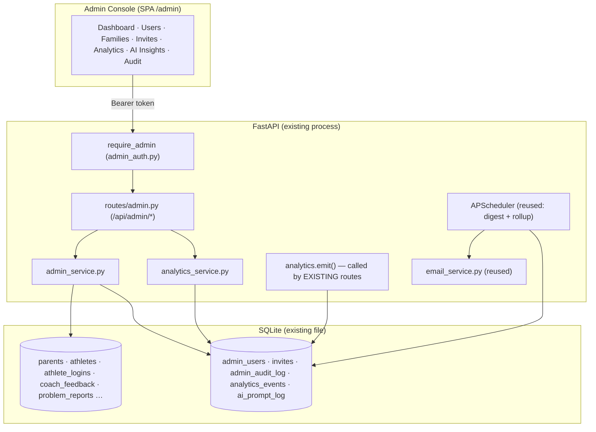

---

## 8. User Administration Design (Priority 1)

The console's home base. Read-first, with three safe support actions.

### Users
A **unified logical "user" view** is *derived*, not a new physical table, to stay additive:

| Logical role | Physical source | Identity shown |
|---|---|---|
| parent | `parents` row | full_name, email, id |
| athlete | `athletes` row (+ `athlete_logins` for "has account") | first_name, age, id |
| admin | `admin_users` row (NEW) | name, email, role |

Future roles (`coach`, `dietitian`, `support_admin`, `nutrition_admin`) slot into
`admin_users.role` with no schema change.

### User status
Today status is implicit. We make it explicit via an **additive nullable `status` column** on
`parents` and `athletes`, defaulting to a value **derived** at backfill:

| Status | Definition (derivation) |
|---|---|
| `invited` | invite sent, not yet accepted (parent never verified OTP / athlete never claimed) |
| `onboarding_incomplete` | account exists but key step missing (athlete `blueprint_json` null/error, or no events, or consent unconfirmed) |
| `active` | consent confirmed + ≥1 athlete with a generated blueprint (parent) / claimed + profiled (athlete) |
| `inactive` | no qualifying activity in N days (derived; not stored) |
| `suspended` | admin-set, blocks login |

`active`/`onboarding_incomplete`/`suspended` are **stored**; `inactive`/`invited` can be **derived**
at read time so we don't fight to keep them fresh. (Decision: store the admin-controlled states,
derive the activity-based ones.)

### Parent↔Athlete relationships
The console's most valuable view: **relationship health**, surfacing the three failure modes the
brief calls out.

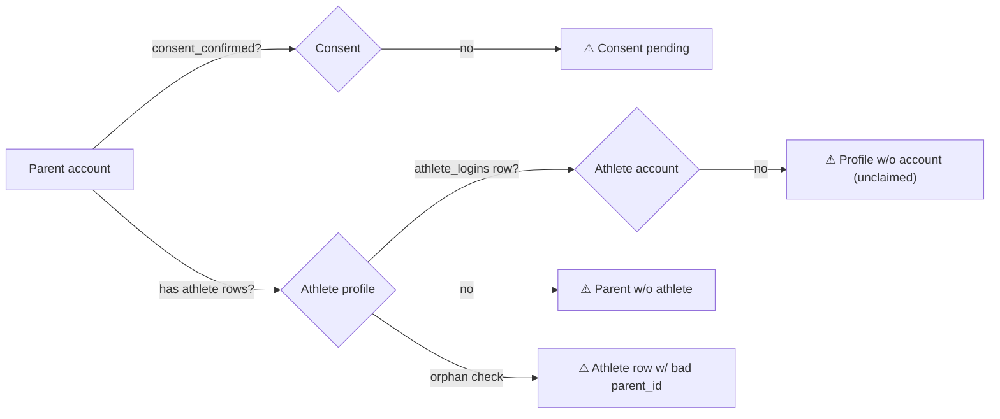

Admin can filter Users/Families by these flags:
- **Parent exists, no athlete** → `parents` with zero `athletes`.
- **Athlete profile exists, no athlete account** → `athletes` with no `athlete_logins`.
- **Athlete account exists, relationship incomplete** → `athlete_logins` whose `athlete_id` →
  `athletes.parent_id` is null/mismatched, or consent unconfirmed.

### Invites
Formalised in a new `invites` table (the claim/OTP flow is the underlying mechanism). Tracked
states: `pending`, `accepted`, `expired` (+`revoked` for completeness). Stores: who/what it's for
(parent email or athlete), token reference, `sent_at`, `accepted_at`, `expires_at`, and a
`reminder_count` / `last_reminded_at` for **reminder history**.

### Support actions (the only writes)
| Action | Endpoint | Effect | Reversible? | Audited |
|---|---|---|---|---|
| Resend invite | `POST /admin/invites/{id}/resend` | re-send email, bump reminder history | n/a | ✅ |
| Deactivate user | `PATCH /admin/users/{id}/status {suspended}` | soft-block login | ✅ (reactivate) | ✅ |
| Reactivate user | `PATCH /admin/users/{id}/status {active}` | restore | ✅ | ✅ |
| View relationship | `GET /admin/families/{id}` | read-only | n/a | (read; optional) |

**No destructive actions in MVP** — no hard delete, no PII edit, no athlete-profile mutation. Status
changes are soft and reversible. Every write requires the action + reason and writes
`admin_audit_log`.

---

## 9. Product Analytics Design (Priority 2)

Answers: who signed up, who completed onboarding, which screens/features are used vs ignored, which
AI questions recur, who returns, where people drop off.

### Event model
A single additive table `analytics_events`, one row per event:

```
analytics_events(
  id, event_name, ts,
  actor_role,        -- parent | athlete | admin | system | anon
  parent_id?, athlete_id?,  -- nullable FKs (de-identified joins only)
  session_id?,       -- opaque client session, not PII
  screen?, feature?, -- for navigation/feature events
  props_json?        -- small JSON bag for event-specific fields
)
```

### Event naming standard
`object_action`, lower_snake_case, past-tense action, stable namespace:
- Lifecycle: `signup_started`, `signup_completed`, `consent_confirmed`,
  `athlete_created`, `blueprint_generated`, `onboarding_completed`.
- Navigation: `screen_viewed` (`screen` prop: `today|blueprint|mealplan|analysis|reports|shopping|coach`).
- Feature: `feature_used` (`feature` prop: `photo_meal_log|voice_meal_log|recipe_swap|water_log|window_confirm|shopping_list_share|…`).
- AI: `ai_question_asked`, `ai_answer_rated` (bridges to `coach_feedback`).
- Engagement: `app_opened` (for DAU/WAU), `streak_milestone_reached`.

Rule: **new events never require schema changes** — only a new `event_name` string + optional
`props_json`.

### Event storage
Same SQLite file, the `analytics_events` table, written server-side from existing routes (highest
fidelity, no ad-blocker loss) plus a thin client hook for `screen_viewed`. Indexed on
`(event_name, ts)` and `(athlete_id, ts)`.

### Retention approach
- Keep **raw events 90 days** (MVP).
- Nightly APScheduler job rolls daily aggregates into an optional `analytics_rollup_daily`
  (event_name, day, count, distinct_actors) — so dashboards stay fast and raw rows can be pruned.
- Document the retention window in the privacy notice. Minors' raw event rows are de-identified
  (IDs, not names) and prunable.

### Reporting approach
- **In-console**: SQL aggregations rendered as simple bar/line/funnel components (no BI tool).
- **Daily founder email** (§20) via `email_service`.
- MVP queries run live over `analytics_events` (or the rollup) — fast at hundreds of users.

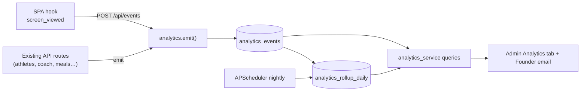

---

## 10. AI Usage Analytics

The product's most differentiated surface — and the most privacy-sensitive, because it concerns
minors asking nutrition questions.

### What we track
We already have `coach_feedback` (rating, question, answer_excerpt, window_key, recipe_intent,
role_hint, reason). We **extend** AI observability with a thin `ai_prompt_log`, capturing per AI
interaction:

| Field | Source | Notes |
|---|---|---|
| `prompt` | user question | **redacted/truncated**; see privacy |
| `prompt_category` | classifier output (`knowledge`/`recipe`/`out_of_scope`) + topic tag | reuses `_classify_coach_path` |
| `surface` | `knowledge_ask` / `coach_chat` / structured | which AI surface |
| `ts` | server time | |
| `actor_role` | parent vs athlete | from request `persona`/`role_hint` |
| `athlete_id?` | nullable | for de-identified cohorting only |
| `feedback_rating?` | join to `coach_feedback` | thumbs up/down |
| `safety_flag?` | `safety_filters` outcome | did input/output filter trigger |
| `window_key?` | coach context | |

### Privacy
- **Default: store category + topic + metadata, not raw transcripts.** Raw `prompt` is **truncated
  and PII-scrubbed** (strip names/emails/numbers) before storage, or hashed if only frequency
  matters.
- Admin UI shows **aggregates** ("top topics," "most common questions" as clustered
  representatives), **not** a browsable feed of a named child's questions.
- Safety-flagged interactions are the **one** place individual review is justified (child-safety) —
  and that view shows the flag + scrubbed text + IDs, gated to a higher capability (Phase 3
  `dietitian`/`safety` role; in MVP, the single admin, audited on view).

### Storage & retention
- `ai_prompt_log` in SQLite; **30–90 day** retention for scrubbed text, longer for the
  category/metadata aggregates (no raw text).
- Safety-flagged rows retained longer per child-safety policy, access-logged.

### Reporting — what admins can see (without violating privacy)
- **Most common questions:** cluster scrubbed prompts by embedding similarity (reuse Titan embed) or
  by `prompt_category` + keyword; show representative phrasings + counts.
- **Most common nutrition topics:** `prompt_category`/topic tag distribution.
- **Most common pain points:** questions correlated with 👎 in `coach_feedback`, or that hit the
  "no approved info" fallback, or that triggered safety flags.

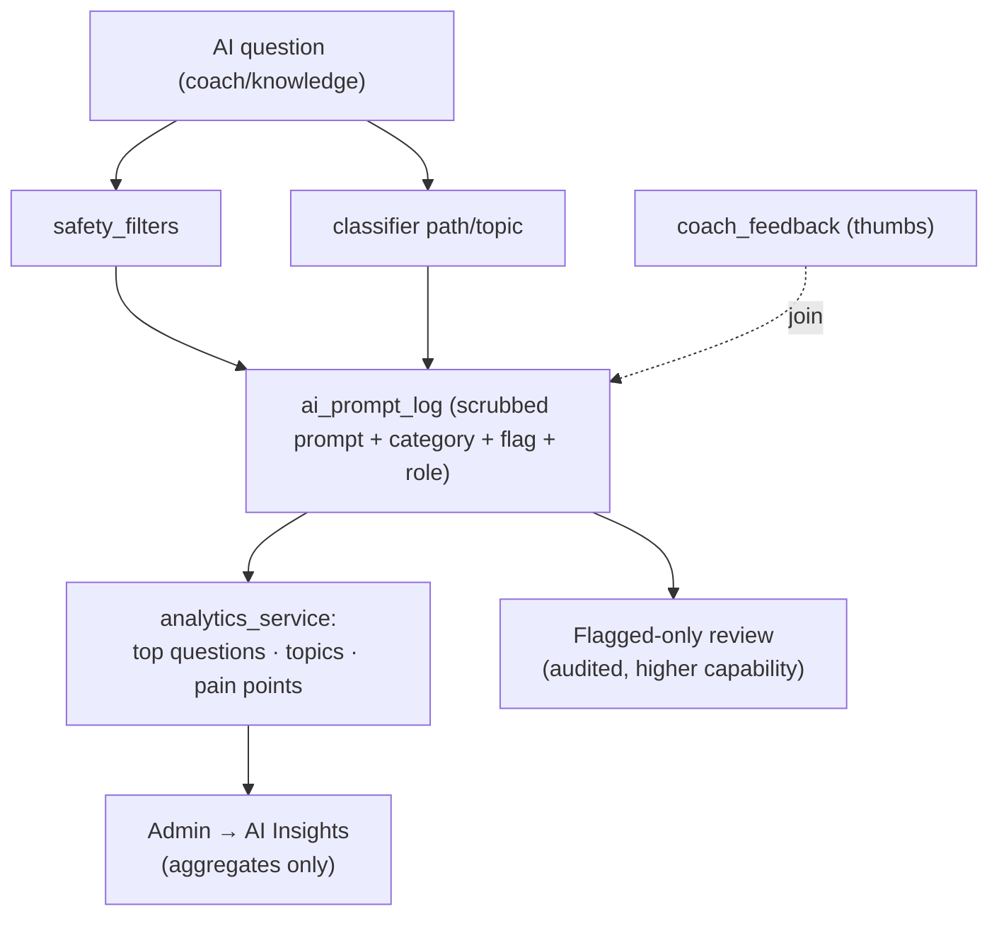

---

## 11. Data Model Design

**Additive only.** New tables + nullable columns. No rewrite of `parents`/`athletes`. Created via
new `_create_*` functions wired into `db_migrations.run_all()` (same pattern as
`_create_coach_feedback`).

### Logical → physical decision on Family / FamilyMember
The brief lists `Family` and `FamilyMember`. The live product already models a household as
`athletes.parent_id → parents.id`. Introducing `Family` + `FamilyMember` join tables would be a
**redesign of the core relationship for zero MVP benefit** — it violates "prefer additive / don't
redesign the DB." **Decision:** treat **"Family" as a logical view** over `parents` (1 family = 1
parent household) and `athletes` (its members). If multi-guardian households are ever needed, a
`family_members` table can be added additively in Phase 3 without touching existing rows.

### Tables (purpose · key fields · relationships)

**`parents`** *(existing — additive change only)*
- Purpose: parent/guardian account (the "Family" anchor).
- Add: `status TEXT NULL` (`active|onboarding_incomplete|suspended`), `deactivated_at TEXT NULL`.
- Rel: `||--o{ athletes`.

**`athletes`** *(existing — additive change only)*
- Purpose: athlete profile (the "AthleteProfile" entity).
- Add: `status TEXT NULL`, `deactivated_at TEXT NULL`.
- Rel: `}o--|| parents`, `||--o| athlete_logins` (has account?).

**`admin_users`** *(NEW)*
- Purpose: internal staff accounts + role seam.
- Fields: `id PK, email UK, full_name, role TEXT ('admin' MVP), is_active BOOL,
  last_login_at TEXT, created_at TEXT`. (MFA fields nullable, reserved for Phase 3.)
- Rel: referenced by `admin_audit_log.actor_admin_id`.

**`invites`** *(NEW — formalises claim/OTP)*
- Purpose: track invite lifecycle + reminder history.
- Fields: `id PK, kind TEXT ('parent'|'athlete'), parent_id FK NULL, athlete_id FK NULL,
  email TEXT, status TEXT ('pending'|'accepted'|'expired'|'revoked'),
  sent_at, accepted_at, expires_at, reminder_count INT, last_reminded_at, created_at`.
- Rel: `}o--o| parents`, `}o--o| athletes`.

**`admin_audit_log`** *(NEW — append-only)*
- Purpose: immutable record of every admin write.
- Fields: `id PK, actor_admin_id FK, action TEXT, target_type TEXT, target_id INT,
  reason TEXT, meta_json TEXT, ip TEXT NULL, created_at`.
- Rel: `}o--|| admin_users`.

**`analytics_events`** *(NEW)*
- Purpose: product analytics spine (§9).
- Fields: `id PK, event_name TEXT, ts TEXT, actor_role TEXT, parent_id NULL, athlete_id NULL,
  session_id NULL, screen NULL, feature NULL, props_json NULL`.
- Indexes: `(event_name, ts)`, `(athlete_id, ts)`.

**`ai_prompt_log`** *(NEW — complements `coach_feedback`)*
- Purpose: AI usage analytics (§10), privacy-scrubbed.
- Fields: `id PK, surface TEXT, prompt_redacted TEXT, prompt_category TEXT, topic TEXT,
  actor_role TEXT, athlete_id NULL, window_key NULL, safety_flag TEXT NULL,
  feedback_id FK NULL, ts TEXT`.
- Rel: `}o--o| coach_feedback`.

**`coach_feedback`** *(existing — unchanged; read by AI Insights)*

**`analytics_rollup_daily`** *(NEW, optional — perf/retention)*
- Purpose: nightly aggregates so raw events can be pruned.
- Fields: `day TEXT, event_name TEXT, count INT, distinct_actors INT, PRIMARY KEY(day,event_name)`.

### ER diagram — additive admin/analytics layer

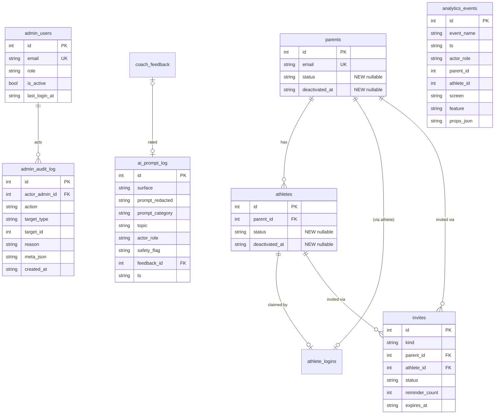

---

## 12. API Design

All under prefix `/api/admin`, all behind `require_admin`. JSON. Cursor/offset pagination
(`?limit=&offset=`), filtering via query params. Validation via Pydantic in `api/models.py`.

### Endpoint catalog

| Method · Path | Purpose | Min capability |
|---|---|---|
| `POST /api/admin/auth/request-otp` | admin login OTP | public (email must be in `admin_users`) |
| `POST /api/admin/auth/verify-otp` | exchange OTP → token | public→token |
| `GET /api/admin/users` | list users (filter: role, status, relationship flags, q) | admin.read |
| `GET /api/admin/users/{id}` | user detail + relationships + recent activity | admin.read |
| `PATCH /api/admin/users/{id}/status` | suspend/reactivate (reason required) | admin.write |
| `GET /api/admin/families` | households + health flags | admin.read |
| `GET /api/admin/families/{id}` | parent + athletes + link state | admin.read |
| `GET /api/admin/invites` | invites (filter: status) | admin.read |
| `POST /api/admin/invites/{id}/resend` | resend + bump reminder history | admin.write |
| `GET /api/admin/analytics` | top-line metrics (counts, WAU, new users) | admin.read |
| `GET /api/admin/analytics/funnels` | onboarding funnel steps | admin.read |
| `GET /api/admin/analytics/features` | feature usage (used vs ignored) | admin.read |
| `GET /api/admin/analytics/ai-insights` | top questions/topics/pain points | admin.read |
| `GET /api/admin/audit-logs` | audit trail (filter: actor, action, date) | admin.read |
| `POST /api/events` | client event collector (`screen_viewed` etc.) | public (rate-limited) |

### Examples

**`GET /api/admin/users?status=onboarding_incomplete&limit=2`**
```json
{
  "total": 17,
  "items": [
    {"id": 42, "role": "athlete", "name": "Maya", "age": 14, "parent_id": 9,
     "status": "onboarding_incomplete", "flags": ["no_athlete_account"],
     "created_at": "2026-06-19T10:02:00Z"},
    {"id": 51, "role": "parent", "name": "J. Rivera", "email": "j…@example.com",
     "status": "onboarding_incomplete", "flags": ["consent_pending","no_athlete"],
     "created_at": "2026-06-20T14:11:00Z"}
  ]
}
```

**`PATCH /api/admin/users/42/status`** — request:
```json
{"status": "suspended", "reason": "duplicate test account from QA"}
```
Validation: `status ∈ {active, suspended}`; `reason` required, 3–500 chars; target must exist.
Response `200`: `{"id":42,"status":"suspended","audit_id":1183}`. Side effect: one
`admin_audit_log` row.

**`POST /api/admin/invites/77/resend`** — response `200`:
```json
{"id":77,"status":"pending","reminder_count":2,"last_reminded_at":"2026-06-22T18:30:00Z","email_sent":true}
```

**`GET /api/admin/analytics/funnels`** — response:
```json
{"funnel":"onboarding","window":"30d",
 "steps":[
   {"step":"signup_started","count":120},
   {"step":"signup_completed","count":104},
   {"step":"consent_confirmed","count":98},
   {"step":"athlete_created","count":86},
   {"step":"blueprint_generated","count":81},
   {"step":"onboarding_completed","count":74}],
 "biggest_dropoff":{"from":"consent_confirmed","to":"athlete_created","lost":12}}
```

**`GET /api/admin/analytics/ai-insights`** — response:
```json
{"window":"7d",
 "top_topics":[{"topic":"pre_game_meal","count":63},{"topic":"hydration","count":41}],
 "top_questions":[{"representative":"what to eat night before a game","count":22}],
 "pain_points":[{"representative":"how much protein","thumbs_down":7,"fallback_hits":4}],
 "safety_flags":{"weight_body_image":3,"medical":5}}
```

### Permissions & validation rules (cross-cutting)
- **Default-deny:** no `/api/admin/*` route is reachable without a valid admin token (except the two
  auth endpoints + the rate-limited public collector).
- **Writes require `reason`**, are validated against enums, and emit audit rows.
- **Reads are projected** (no raw transcripts, athlete names minimised).
- **Rate-limit** `/api/events` and admin OTP (reuse the 1/60s OTP limiter pattern).
- **Idempotency:** status PATCH is idempotent; resend is safe to repeat (bumps reminder count).

---

## 13. Admin User Experience Design

Three console layouts evaluated.

### Option A — Table-Driven
Dense, sortable/filterable tables per entity; row click → modal.
- **Pros:** fastest to build; familiar; great for scanning/filtering relationship flags; scales to
  hundreds of rows trivially.
- **Cons:** detail-heavy entities (a family's full picture) feel cramped in a modal.
- **Scalability:** high for MVP data volumes.

### Option B — Card + Detail Panel (master–detail)
Left list (cards), right detail panel.
- **Pros:** excellent for relationship-centric work (see a family's parent+athletes+invites at
  once); good support-triage ergonomics.
- **Cons:** slightly more build; less efficient for bulk scanning than tables.
- **Scalability:** good.

### Option C — Operations Dashboard-first
Landing = KPI tiles + alert lists ("12 stuck in onboarding"), drilling into A/B views.
- **Pros:** best founder/operator daily-driver; surfaces problems proactively.
- **Cons:** more design effort; needs the analytics spine to be meaningful.
- **Scalability:** high.

**Recommendation — hybrid: C (landing) → A (lists) → B (detail).** A dashboard home that surfaces
problems, tables for scanning/filtering each entity, and a master-detail drawer for the *Families*
view where relationships matter most. All three reuse the same SPA host and fetch convention.

---

## 14. UI Wireframes (desktop, low-fidelity)

**Dashboard**
```
┌───────────────────────────────────────────────────────────────────────┐
│ FuelUp Admin            Dashboard  Users  Families  Invites  Analytics  │
│                         AI Insights  Audit              [admin@…  ⏻]    │
├───────────────────────────────────────────────────────────────────────┤
│  ┌Total Users┐ ┌Parents┐ ┌Athletes┐ ┌Incomplete┐ ┌Pending Invites┐     │
│  │   142     │ │  78   │ │   64   │ │   17 ⚠   │ │      9         │     │
│  └───────────┘ └───────┘ └────────┘ └──────────┘ └────────────────┘     │
│  ┌ Needs attention ───────────────┐  ┌ This week ───────────────────┐   │
│  │ • 12 athletes stuck pre-blueprint│ │ New users      ▁▂▅▇   +23     │   │
│  │ • 5 parents consent pending      │ │ WAU            ▃▄▅▆▇  88      │   │
│  │ • 3 invites expiring <24h         │ │ AI questions   ▂▅▇▆▃  312    │   │
│  └──────────────────────────────────┘ └──────────────────────────────┘   │
│  ┌ Top features ──────────────┐  ┌ Top AI topics ────────────────────┐   │
│  │ Today confirm     ███████  │  │ Pre-game meal      ██████          │   │
│  │ Photo meal log    █████     │  │ Hydration          ████            │   │
│  │ Coach chat        ████      │  │ Recovery snack     ███             │   │
│  └────────────────────────────┘  └────────────────────────────────────┘   │
└───────────────────────────────────────────────────────────────────────┘
```

**Users**
```
┌ Users ────────────────────────────────────────────────────────────────┐
│ [search q…] Role:[all▾] Status:[all▾] Flag:[relationship▾]   142 users │
├────┬─────────────┬────────┬────────────────────┬──────────┬───────────┤
│ ID │ Name        │ Role   │ Status             │ Flags    │ Created   │
├────┼─────────────┼────────┼────────────────────┼──────────┼───────────┤
│ 51 │ J. Rivera   │ parent │ onboarding_incompl │ consent⚠ │ 06-20     │
│ 42 │ Maya        │ athlete│ onboarding_incompl │ no-acct⚠ │ 06-19     │
│ 33 │ A. Chen     │ parent │ active             │ —        │ 06-12     │
│ …  │             │        │                    │          │  ‹ 1 2 3 ›│
└────┴─────────────┴────────┴────────────────────┴──────────┴───────────┘
  (row click → detail modal: profile · linked accounts · activity · actions)
```

**Families** (master–detail)
```
┌ Families ─────────────────┬───────────────────────────────────────────┐
│ [search]  Flag:[broken▾]  │  Rivera household              Family #51  │
│ ▸ Rivera         ⚠        │  Parent: J. Rivera <j…@…>  consent: PENDING│
│ ▸ Chen                    │  Athletes:                                 │
│ ▸ Okafor         ⚠        │   • Maya (14)  profile ✓  account ✗ unclaim│
│ ▸ Patel                   │   • (no second athlete)                    │
│ …                         │  Invites: 1 pending (sent 06-19, 2 remind) │
│                           │  [Resend invite]  [Suspend]  [View audit]  │
└───────────────────────────┴───────────────────────────────────────────┘
```

**Invites**
```
┌ Invites ───────────────────────────────────────────────────────────────┐
│ Status:[all▾]                                                  9 pending │
├────┬──────────┬───────────────┬─────────┬──────────┬─────────┬─────────┤
│ ID │ Kind     │ For           │ Status  │ Sent     │ Reminds │ Action  │
├────┼──────────┼───────────────┼─────────┼──────────┼─────────┼─────────┤
│ 77 │ athlete  │ Maya (#42)    │ pending │ 06-19    │ 2       │ [Resend]│
│ 80 │ parent   │ k…@ex.com     │ expired │ 06-10    │ 1       │ [Resend]│
└────┴──────────┴───────────────┴─────────┴──────────┴─────────┴─────────┘
```

**Analytics**
```
┌ Analytics ─────────────────────────────────────────────────────────────┐
│ Range:[30d▾]                                                            │
│ Onboarding funnel                          Feature usage                │
│ signup_started     ████████████ 120        Today confirm    ███████ 91% │
│ signup_completed   ███████████  104        Photo log        █████   58% │
│ consent_confirmed  ██████████   98         Coach chat       ████    47% │
│ athlete_created    █████████    86 ◀ -12   Recipe swap      ██      19% │
│ blueprint_gen      ████████     81         Shopping share   █        9% │
│ onboarding_done    ███████      74         ──ignored──      Voice log 3%│
│                                                                         │
│ DAU/WAU  ▁▂▃▅▆▇▇▆  WAU 88 / DAU 31        Retention(W1→W2) 41%         │
└─────────────────────────────────────────────────────────────────────────┘
```

**AI Insights**
```
┌ AI Insights (7d) ──────────────────────────────────────────────────────┐
│ Top questions                       Top topics            Pain points   │
│ • "what to eat night before" 22     pre_game_meal  ██████  • "how much  │
│ • "good pre-game snack"      18     hydration      ████      protein"   │
│ • "how much water"           14     recovery       ███       👎7 fb4    │
│ ...                                 out_of_scope   ██      Safety flags │
│                                                            weight:3 med:5│
│ [⚠ Flagged interactions (8) — review]   (audited access)               │
└─────────────────────────────────────────────────────────────────────────┘
```

**Audit Logs**
```
┌ Audit Logs ────────────────────────────────────────────────────────────┐
│ Actor:[all▾] Action:[all▾] Date:[7d▾]                                   │
├──────────────┬───────────┬───────────────┬───────────────┬─────────────┤
│ When         │ Admin     │ Action        │ Target        │ Reason      │
├──────────────┼───────────┼───────────────┼───────────────┼─────────────┤
│ 06-22 18:30  │ mayur     │ invite.resend │ invite#77     │ parent ask  │
│ 06-22 17:02  │ mayur     │ user.suspend  │ athlete#42    │ QA dup acct │
└──────────────┴───────────┴───────────────┴───────────────┴─────────────┘
```

---

## 15. Dashboard Design

**Recommended widgets (MVP):** Total Users · Parents · Athletes · Incomplete Onboarding (with ⚠) ·
Pending Invites · New Users (this week, sparkline) · WAU · Most-Used Features · Top AI Topics. Plus a
**"Needs attention"** alert list (stuck onboarding, consent pending, invites expiring) — this is the
operator's daily entry point.

**Layout options:**
- **A — KPI tiles + two-column panels** (recommended; matches §14 wireframe): tiles up top, "needs
  attention" + "this week" mid, feature/AI bars below.
- **B — Single feed of alerts** (problems first, metrics secondary): good if the team is purely
  reactive support.
- **C — Metrics-grid** (BI-style tiles only): cleaner but less actionable; defer.

Recommend **A** — balances at-a-glance counts with actionable alerts, all answerable with SQL over
existing + analytics tables.

---

## 16. Analytics Dashboard Design (visualizations)

| Visualization | Data | Recommended render |
|---|---|---|
| Onboarding funnel | `analytics_events` lifecycle steps | horizontal bar funnel + biggest-drop callout |
| Feature usage (used vs ignored) | `feature_used` counts ÷ active users | % bars, "ignored" section below threshold |
| DAU / WAU | `app_opened` distinct actors/day,week | sparkline + current numbers |
| Retention (W1→W2 cohort) | first-seen vs return | single cohort % (MVP), grid later |
| AI prompt categories | `ai_prompt_log.prompt_category` | bar |
| Top questions | clustered scrubbed prompts | ranked list w/ counts |
| Drop-off points | consecutive funnel deltas | highlight largest delta |

**Recommendation:** keep renders to **bars, sparklines, and ranked lists** — no charting library
needed beyond lightweight inline SVG/CSS. Cohort retention starts as a single number; a full
retention grid is Phase 3. Everything reads from `analytics_events` / `analytics_rollup_daily`.

---

## 17. Security Design (practical MVP)

| Control | MVP implementation |
|---|---|
| **RBAC** | `admin_users.role` (single `admin` now); guard checks role∈allowed; capability map for future roles |
| **Admin API protection** | one `/api/admin` router, **all** routes behind `require_admin` (default-deny); the two auth + public collector are the only exceptions |
| **Authorization checks** | per-route min-capability; writes gated to `admin.write`; flagged-AI view gated higher |
| **Audit logging** | append-only `admin_audit_log` on every write; actor = authenticated admin (real attribution, unlike today's shared key) |
| **Sensitive data protection** | read projections strip transcripts; emails partially masked in lists; no PII export in MVP |
| **Minor data protection** | athlete surfaces show first name + id; AI insights aggregated; raw prompts scrubbed/truncated (see §10/§18) |
| **Session management** | short-lived signed admin token (e.g. 30–60 min) from OTP verify; re-auth on expiry; no long-lived shared secret in client code |
| **Future MFA readiness** | nullable MFA fields reserved on `admin_users`; OTP-email already a second-factor-ish step |
| **Soft deletes** | status flags + `deactivated_at`; **no hard delete** from console |
| **Least privilege** | admin reads scoped/projected; only 3 write actions exist; DB writes parameterised |

**Two debts to retire (called out honestly):**
1. The frontend hardcodes `ADMIN_KEY = "fuelup-admin"` in `LibraryAdmin.jsx` and the env default is
   the same literal — a secret shipped to the browser. The admin module **replaces** this with
   token auth; the legacy library/knowledge ingest endpoints should migrate to the same guard (or at
   minimum stop hardcoding the key client-side).
2. CORS is `allow_origins=["*"]` (acceptable dev-stage per HLD, but admin endpoints should be
   tightened to the app origin before/at admin launch).

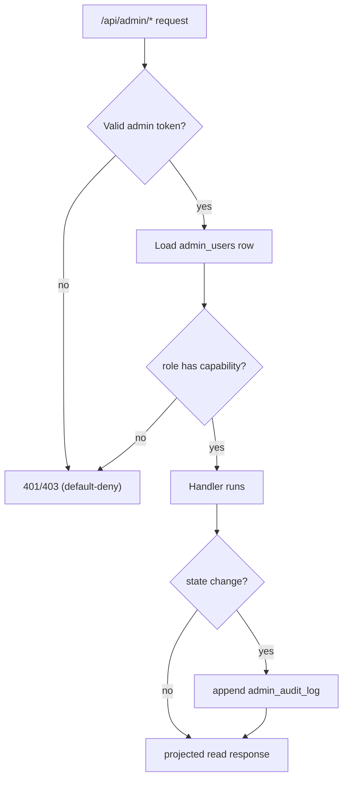

---

## 18. Privacy & Youth Data Considerations

FuelUp serves minors (9–17); every admin decision is filtered through that.

- **Parental consent** remains the gate; the console *surfaces* consent state but never bypasses it.
- **Athlete data protection:** default views show first name + id, not full DOB/contact; no athlete
  free-text health detail surfaced beyond what's operationally necessary.
- **Limited exposure:** AI insights are **aggregates**; a named child's question history is **not** a
  browsable feature. The single exception — safety-flagged interactions — is access-audited and will
  be capability-gated when roles arrive.
- **Privacy controls:** raw AI prompts are **PII-scrubbed and truncated** before storage; retention
  windows are short for raw text (30–90d) and prunable; rollups hold no raw text.
- **Safe logging:** `admin_audit_log` records actor/action/target/reason — not the *content* of
  minors' data. Analytics events carry IDs, not names. No PII in application logs.
- **Data residency:** unchanged — all data stays in SQLite on the Fly.io VM; only Bedrock sees
  inference text, as today.

---

## 19. Mermaid Diagrams

### System Architecture (with admin overlay)
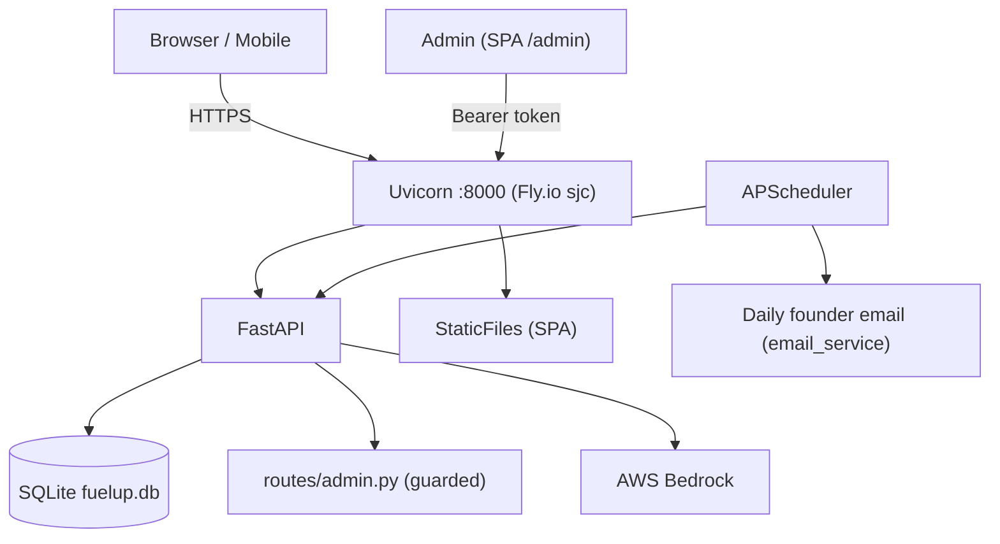

### Admin Architecture
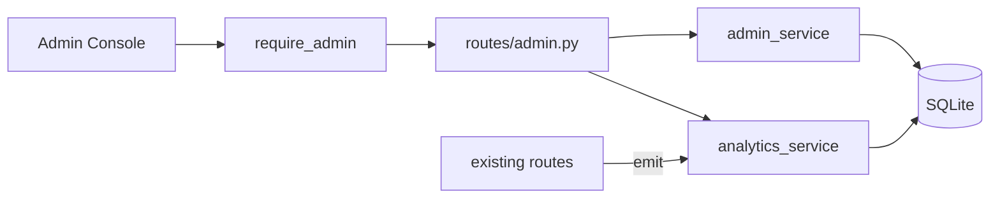

### User Administration Data Model
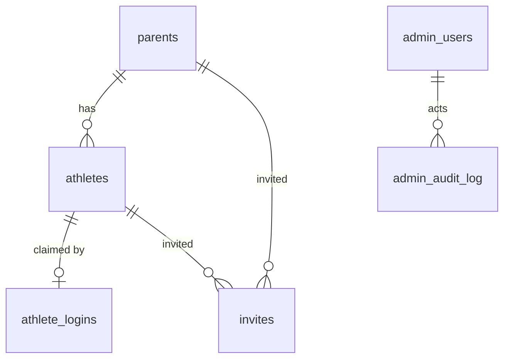

### Parent↔Athlete Relationship Model
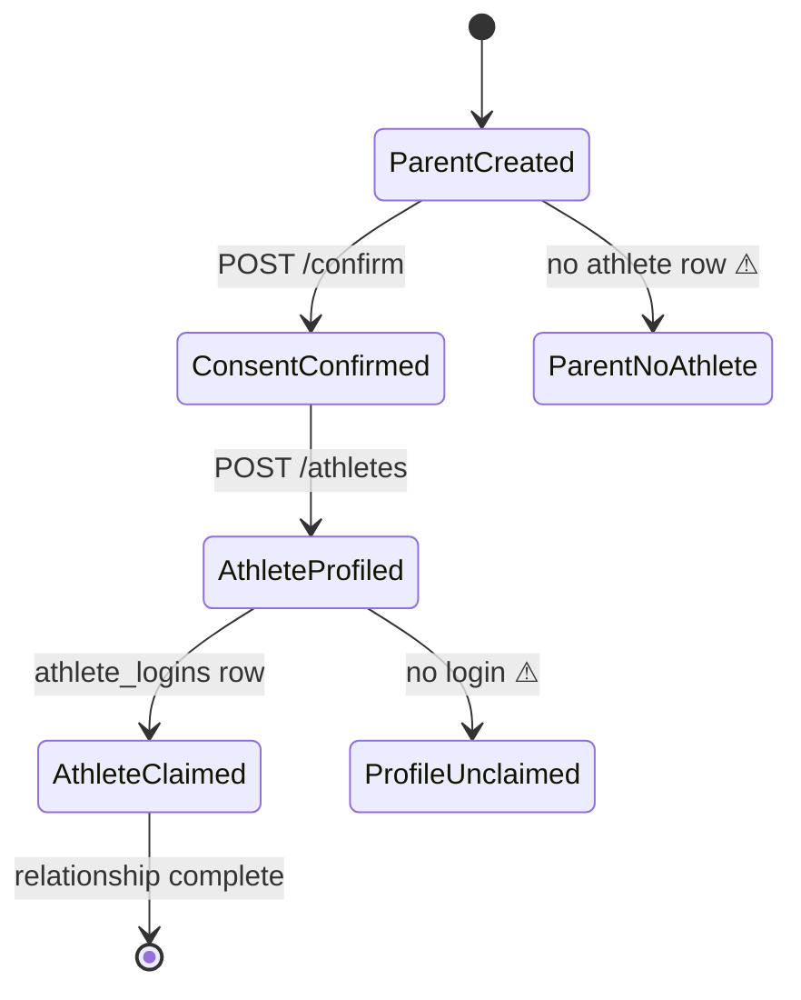

### Invite Lifecycle
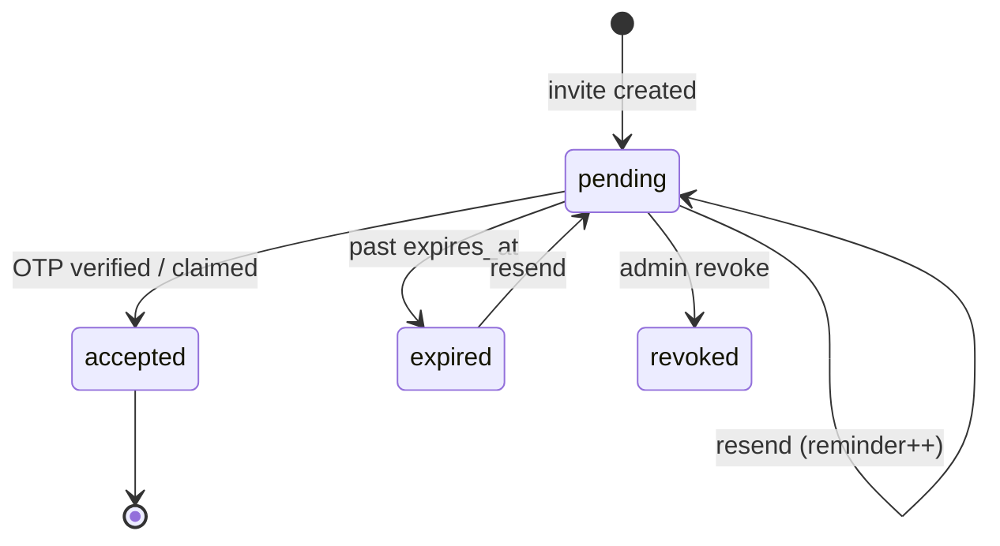

### Analytics Event Flow
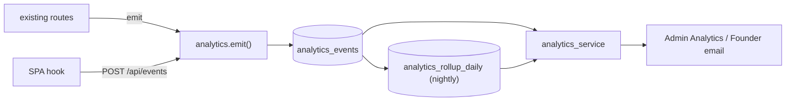

### AI Prompt Analytics Flow
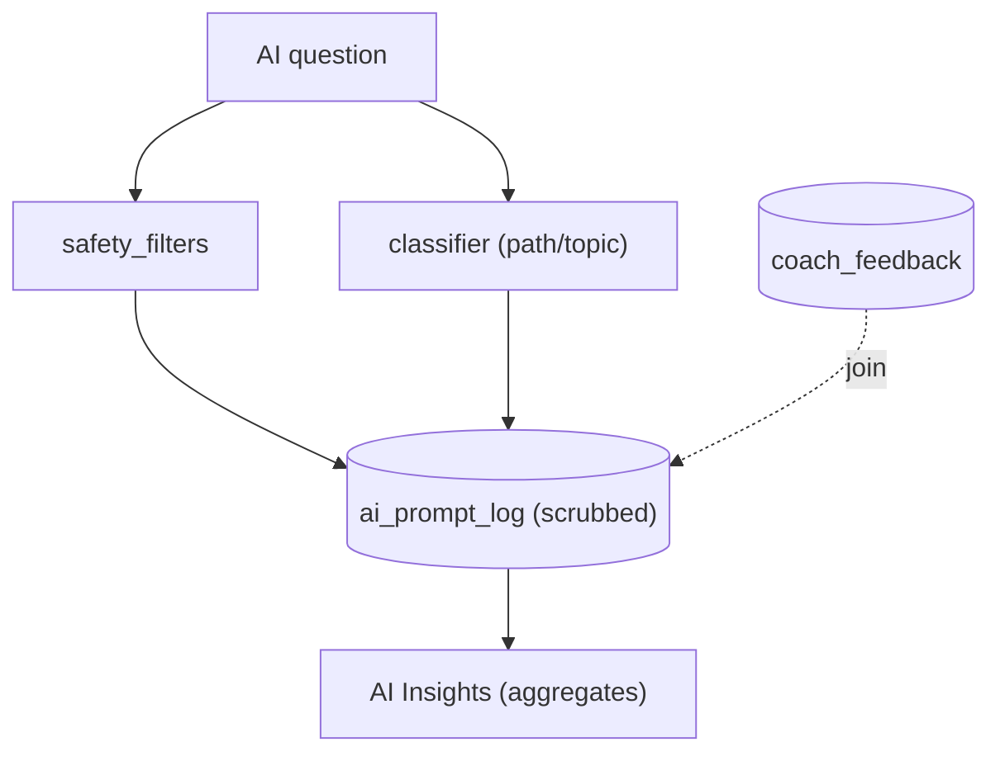

### Admin Authorization Flow
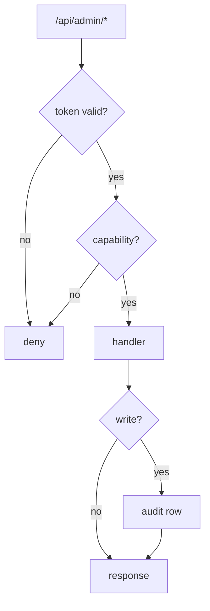

### Onboarding Funnel
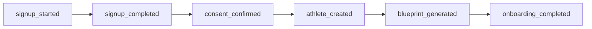

---

## 20. Founder Reporting (Daily Report)

A once-daily email (APScheduler tick + `email_service.py`, same Gmail SMTP used for problem
reports), sent to the founders. Answers: signups, activations, onboarding completions, features
used, AI questions asked, issues to investigate.

**Layout (sections):**
1. **Yesterday at a glance** — new signups, activations, onboarding completions, WAU.
2. **Onboarding health** — # stuck, biggest drop-off step, consent-pending count.
3. **Usage** — top 3 features, top 3 ignored features.
4. **AI** — top 3 questions/topics, # 👎, # safety flags.
5. **Investigate** — alerts: invites expiring, blueprint-generation errors, spikes in safety flags
   or 👎, new `problem_reports`.

**Email format example (plain text — matches existing email style):**
```
Subject: FuelUp Daily — 2026-06-22

YESTERDAY
  New signups: 23   Activated: 14   Onboarding done: 11   WAU: 88

ONBOARDING HEALTH
  Stuck: 17  •  Biggest drop: consent→athlete_created (-12)  •  Consent pending: 5

USAGE
  Top: Today-confirm (91%), Photo-log (58%), Coach (47%)
  Ignored: Voice-log (3%), Shopping-share (9%)

AI
  Top topics: pre-game meal (63), hydration (41), recovery (22)
  Thumbs-down: 7   Safety flags: weight 3 / medical 5

INVESTIGATE
  • 3 invites expire in <24h
  • 1 blueprint generation error (athlete #58)
  • 2 new problem reports
```

An **HTML variant** can reuse the same data with simple tables if richer formatting is wanted; the
plain-text version is the MVP (consistent with `email_service` today).

---

## 21. Build Phases

### Phase 1 — User Administration (Priority 1) — *the operational win*
- Migrations: `admin_users`, `admin_audit_log`, `invites`; additive `status`/`deactivated_at` on
  `parents`/`athletes` + one-time backfill (derive status).
- Auth: admin OTP login + `require_admin` guard + token mint/verify.
- API: users (list/detail), families (list/detail + relationship flags), invites (list/resend),
  status PATCH, audit-logs.
- UI: console shell + Dashboard (counts + needs-attention) + Users + Families + Invites + Audit.
- **Why first:** highest-value, lowest-dependency; replaces SSH-SQL immediately; relationship-health
  is the top support need; lays auth + audit seams everything else depends on.

### Phase 2 — Product Analytics (Priority 2)
- Migrations: `analytics_events`, `ai_prompt_log`, optional `analytics_rollup_daily`.
- Emit: `analytics.emit()` helper + instrument existing routes (lifecycle + feature events) + client
  `screen_viewed` hook + `/api/events` collector; scrubbed `ai_prompt_log` write in coach/knowledge
  paths.
- API: analytics (top-line, funnels, features, ai-insights).
- UI: Analytics + AI Insights tabs; dashboard usage/AI widgets.
- Jobs: nightly rollup + retention prune; **daily founder email**.
- **Why second:** depends on the admin console + auth from Phase 1; analytics value compounds once
  events accrue, so start emitting as early as possible (the emit helper can ship *with* Phase 1 even
  if dashboards come later).

### Phase 3 — Future Expansion
- Additional roles (coach, dietitian, support/nutrition admin) via `role` + capability map; MFA;
  cohort-retention grid; flagged-AI review workflow; possible `family_members` for multi-guardian;
  migrate legacy `X-Admin-Key` endpoints to token auth; tighten CORS.
- **Why later:** none of it is needed at dozens–hundreds of users; all of it is additive on the
  Phase 1–2 seams.

---

## 22. Architecture Review (self-review)

| Dimension | Assessment |
|---|---|
| **Simplicity** | Strong. One router, one guard, additive tables, same VM/DB/migration mechanism. No new infra. |
| **Security** | Improved vs today (replaces shared static key with admin identity + audit). Two known debts flagged (hardcoded key, open CORS) with a retirement path. |
| **Maintainability** | Good. Follows existing route/service split and `_create_*` pattern; one retention job is the only moving part. |
| **Cost** | ~zero incremental (same VM). SQLite growth bounded by retention. |
| **Scalability** | Sufficient for the stated dozens–hundreds. Honest ceiling: SQLite single-writer + event volume; the rollup/retention job and the Phase-3 external-store seam address the tail. |
| **MVP fit** | High — answers every brief question with the smallest footprint. |

**Over-engineered areas to watch / cut if needed:**
- `analytics_rollup_daily` is **optional** at MVP volumes — don't build until raw queries feel slow.
- Embedding-based question clustering for "top questions" can start as simple keyword/category
  grouping; add embeddings only if clusters are noisy.

**Under-designed areas (acknowledged):**
- **Admin token mechanics** (signing/expiry/refresh) are described at principle level, not specced —
  the implementation plan must pin the exact scheme (e.g. itsdangerous-signed token vs server-side
  session row). Recommended: a server-side `admin_sessions` row keyed by random token (simplest,
  revocable, no new crypto lib) — to decide at implementation.
- **Status backfill correctness** — the derive-on-backfill rules need test coverage against real
  rows.
- **Client event loss** — `screen_viewed` via client hook can be blocked; server-side emit for
  critical lifecycle events is the mitigation (already the design).

**Risks:**
- SQLite write contention if analytics emit is chatty + synchronous → mitigate with lightweight,
  non-blocking inserts and/or batching; keep emit off the hot request path where possible.
- Privacy regression if raw prompts leak into logs → enforced scrubbing + review in implementation.
- Scope creep toward CRM/BI → guarded by §5 non-goals.

**Technical debt created:** the optional rollup table + retention job; a second auth mechanism
co-existing with the legacy `X-Admin-Key` until migrated. Both are acceptable and scheduled.

**Revision after review:** make the **emit helper part of Phase 1** (cheap, starts data accruing
early) while keeping **dashboards in Phase 2** — the only change from the first pass. No structural
changes needed; the design holds.

---

## 23. Final Recommendation

- **Recommended architecture:** **Option B (Balanced MVP + Future Growth)**, sequenced so Phase 1 is
  barely larger than the fastest option while planting every seam (admin identity, audit, event
  spine) the product will need.
- **Recommended UI:** **Hybrid — Operations-Dashboard landing → Table-driven lists → master-detail
  Families drawer.**
- **Build now (Phase 1 + emit helper):** admin OTP auth + guard; `admin_users`, `admin_audit_log`,
  `invites`, additive `status` columns; Users/Families/Invites/Audit + Dashboard; the
  `analytics.emit()` helper wired into lifecycle events so data starts accruing.
- **Build next (Phase 2):** analytics + AI-insights dashboards; `analytics_events` / `ai_prompt_log`
  full instrumentation; nightly rollup/retention; daily founder email.
- **Wait (Phase 3):** extra roles, MFA, retention grid, flagged-AI workflow, CORS tightening, legacy
  key migration.
- **Estimated effort:** Phase 1 ≈ 1–1.5 weeks; Phase 2 ≈ 1–1.5 weeks (one engineer), within the
  existing stack — no new infrastructure or services.
- **Major risks:** SQLite write contention from chatty analytics (mitigated by lightweight/batched
  inserts); privacy regression on minors' AI text (mitigated by scrubbing + aggregate-only views);
  the two existing security debts (hardcoded admin key, open CORS) — retired during/after admin
  launch.
- **Future roadmap:** roles & MFA → richer retention/cohorts → flagged-AI review → (only if scale
  demands) an external analytics store behind the same `analytics_service` interface, which is the
  one seam designed to make that a swap, not a rewrite.

---

*Design only. No code, migrations, or schema changes are applied by this document. Awaiting approval
before an implementation plan (backend / frontend / DB / APIs / testing / rollout / AI-agent
execution / acceptance criteria) is produced.*
