# FuelUpYouth — High-Level Design

**Version:** 1.3  
**Date:** 2026-06-22  
**Status:** For Review  
**Attribution:** Science framework — Everett MD 2025 · Boston Children's Hospital RDN · AAP · ACSM 2016

---

## Changelog

### v1.3 (2026-06-22)
- **Support / Problem Reports** — new `POST /api/support/report` endpoint, `problem_reports` table, and `email_service.py` (Gmail SMTP). The in-app "Report a Problem" form now persists and emails the team. See [§6.11](#611-support--problem-reports).
- **Today `has_schedule` flag** — `build_today_view` now returns `has_schedule` (true if the athlete has any events ever), letting the client distinguish "no schedule set up yet" from a genuine rest day.
- **Bedrock resilience** — `bedrock_client` now performs **1 retry on transient failures** (was 0 / fail-fast).
- **Latency** — one Fly machine kept warm to remove cold-start latency; `get_weather()` gains an in-memory TTL cache.
- **Auth hardening** — athlete-login claim path hardened; `athlete_logins` gains a `UNIQUE(athlete_id)` rebuild migration (defense-in-depth behind the code-level guard).
- **Frontend loading UX** — shared `LoadingState`/`ErrorState` toolkit, rotating copy, and recoverable errors across AI screens; blueprint polls while generating instead of erroring.

### v1.2 (2026-06-21)
- Event intensity (§6.3, §10.4, ER diagram, §11); streak gamification.

---

## Table of Contents

1. [System Overview](#1-system-overview)
2. [Technology Stack](#2-technology-stack)
3. [Deployment Architecture](#3-deployment-architecture)
4. [Application Architecture](#4-application-architecture)
5. [API Route Inventory](#5-api-route-inventory)
6. [Domain Modules](#6-domain-modules)
7. [AI / ML Layer](#7-ai--ml-layer)
8. [AI Coach — Input, Processing & Response](#8-ai-coach--input-processing--response)
9. [Data Layer](#9-data-layer)
10. [Nutrition Science Layer](#10-nutrition-science-layer)
11. [Frontend Architecture](#11-frontend-architecture)
12. [Push Notifications](#12-push-notifications)
13. [CI / CD Pipeline](#13-ci--cd-pipeline)
14. [Security & Compliance](#14-security--compliance)
15. [Streak Gamification](#15-streak-gamification)

---

## 1. System Overview

FuelUpYouth (branded **Fueling2Win**) is a science-backed pediatric sports nutrition platform targeting youth soccer athletes aged 13–17. It provides:

- Personalised nutrition targets computed from the Everett MD 2025 RMR formula
- AI-generated nutrition blueprints, meal analysis, weekly reports, and meal plans
- A multi-turn conversational Nutrition Coach powered by AWS Bedrock with a RAG knowledge base
- A parent-facing shopping/fuel list driven by the athlete's weekly schedule
- Push notifications timed to pre-game, snack, hydration, and meal-log windows

The system is an educational food guidance tool, not medical nutrition therapy. This distinction is enforced in every AI prompt, every response, and every legal document surfaced in the app.

---

## 2. Technology Stack

| Layer | Technology | Notes |
|---|---|---|
| **Backend framework** | FastAPI (Python) | Async-capable; Uvicorn ASGI server |
| **Database** | SQLite (raw `sqlite3`) | Single file `fuelup.db`; no ORM |
| **AI runtime** | AWS Bedrock Converse API | Default model: `mistral.ministral-3-8b-instruct` |
| **Embeddings** | AWS Bedrock Titan Embed v2 | `amazon.titan-embed-text-v2:0`; cosine similarity retrieval |
| **Nutrition database** | USDA Food Data Central (FDC) | Used by photo/voice meal analysis for macro lookup after Bedrock identifies food items |
| **Background jobs** | APScheduler (`BackgroundScheduler`) | Notification tick every 15 min |
| **Frontend** | React (Vite) | SPA, no router library; view state via `useState` |
| **Push notifications** | Web Push / `pywebpush` (VAPID) | Web; Expo push tokens for mobile |
| **Transactional email** | Gmail SMTP (`smtplib`, stdlib) | `email_service.py`; problem-report notifications; `GMAIL_USER`/`GMAIL_APP_PASSWORD` secrets |
| **Hosting** | Fly.io (single VM, region `sjc`) | Uvicorn serves API + static frontend |
| **CI / CD** | GitHub Actions → `flyctl deploy` | Auto-deploy on push to `main` |
| **Environment config** | `.env` / Fly.io secrets | `DB_PATH`, `AWS_*`, `VAPID_*` keys |

---

## 3. Deployment Architecture

A single Fly.io VM runs everything. Uvicorn binds on port 8000 and serves:
- All `/api/*` routes (FastAPI)
- The compiled React SPA from `frontend/dist/` via `StaticFiles` mounted at `/` (last, so API routes take precedence)

**Latency:** one machine is kept warm (no scale-to-zero) to eliminate cold-start latency on the first request. `get_weather()` uses an in-memory TTL cache so repeated weather lookups within the window avoid redundant external calls.

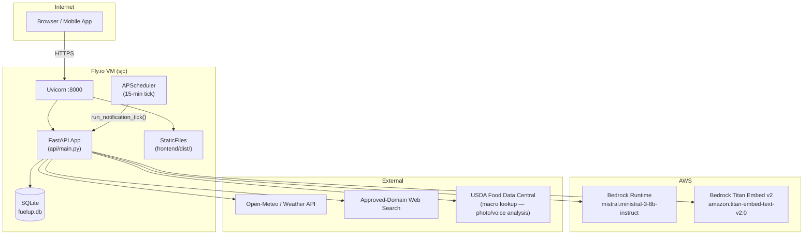

---

## 4. Application Architecture

The backend is decomposed into **routes** (HTTP handlers) and **services** (business logic). Routes call services; services never call routes.

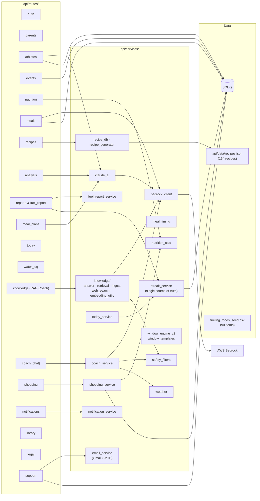

### Startup Sequence

On server start, two things run:

1. **`run_startup()`** (lifespan context) — triggers `run_all()` database migrations.
2. **`on_startup()`** (legacy event hook) — also calls `db_migrations.run_all()` (idempotent), then starts the APScheduler notification job.

`db/setup.py::init_db()` is safe to call multiple times (`CREATE TABLE IF NOT EXISTS`). It also runs `seed_fueling_foods()` which upserts the food catalog from `fueling_foods_seed.csv`.

---

## 5. API Route Inventory

All routes use the `/api/` prefix.

| Tag | Prefix | Key Endpoints |
|---|---|---|
| Auth | `/api/auth` | OTP request/verify |
| Parental Consent | `/api/parents` | Create, confirm consent, login by email, OTP flow |
| Athlete Profiles | `/api/athletes` | CRUD, blueprint fetch/regenerate, today screen (includes streak), fuel report, `POST /{id}/confirmations` (window confirm → returns streak block) |
| Schedule | `/api/events` | CRUD events (with `intensity`), ICS calendar fetch |
| Nutrition Targets | `/api/nutrition` | Compute daily targets (intensity-aware), sweat output, meal timing, macro estimate |
| Meal Tracking | `/api/meals` | Photo analysis, voice analysis, log meal, list/delete |
| Recipe Database | `/api/recipes` | List, filter, generate, swap, fetch by ID |
| Gap Analysis | `/api/analysis` | Traffic-light analysis for a date |
| Reports | `/api/reports` | Daily score, weekly report v1/v2, tournament readiness |
| Meal Planner | `/api/meal-plans` | Week plan CRUD, slot assignment, log slot, AI generation |
| Meal Plan Selections | `/api/meal-plan` | Athlete-driven slot selections |
| Today Screen | `/api/athletes/{id}/today` | Aggregated daily view — includes `streak` block (current count, best, 7-dot week strip, freeze state, milestone) and `has_schedule` (false = athlete has no events ever, vs. a genuine rest day) |
| Water Log | `/api/water-log` | Log water intake |
| Knowledge / RAG Coach | `/api/knowledge` | `/ask` (RAG coach), `/sources`, `/health`, admin ingest |
| Nutrition Coach Chat | `/api/coach` | `/context` (prefetch), `/chat` (multi-turn) |
| Shopping / Fuel List | `/api/shopping` | Essentials, shopping list CRUD, food prefs, food submissions |
| Notifications | `/api/notifications` | VAPID key, web push subscribe, Expo token, prefs |
| Library | `/api/library` | Articles, athlete article picks |
| Legal | `/api/legal` | Legal document storage |
| Support | `/api/support` | `POST /report` — submit a problem report (multipart: description, app_version, platform, role_hint, optional screenshot) |
| Info / Health | `/api/info`, `/health` | Version info, health probe |

---

## 6. Domain Modules

### 6.1 Authentication & Parental Consent

All accounts require a parent/guardian. The flow is:

```mermaid
sequenceDiagram
    participant App
    participant API as /api/parents

    App->>API: POST /request-otp {email}
    API-->>App: 200 (OTP sent via email; rate-limited 1/60s)
    App->>API: POST /verify-otp {email, code}
    API-->>App: {parent, athletes[]}
    Note over API: OTP hashed in otp_codes table; expires in 10 min; single-use
```

A parent also calls `POST /confirm` to record `consent_confirmed = true` before an athlete profile can be fully activated.

**Athlete login (claim):** athletes get their own login credential via the claim flow (`athlete_logins` table, keyed to a verified parent). The claim path is guarded against duplicate logins at the code level, with a `UNIQUE(athlete_id)` rebuild migration on `athlete_logins` as defense-in-depth (`_migrate_athlete_logins_unique` in `db_migrations.py`). No athlete login exists without a verified parent account.

### 6.2 Athlete Profiles & Blueprint Generation

When an athlete is created (`POST /api/athletes`), a **background task** immediately triggers blueprint generation:

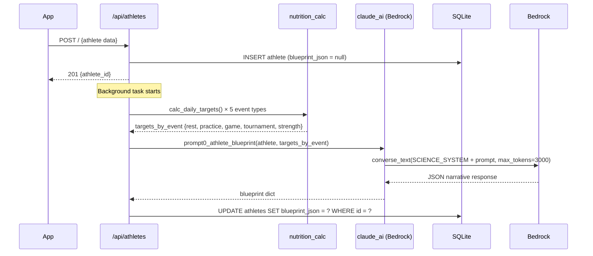

While generating, `blueprint_json` holds a sentinel `{"__status": "generating", "started_at": "..."}`. The frontend polls `GET /api/athletes/{id}/blueprint` and reacts to this status. On error, it becomes `{"__status": "error", ...}`.

**Competition Level** — athletes are classified into one of three tiers (stored in `athletes.competition_level`):

| Tier | Examples |
|---|---|
| Recreational | AYSO, YMCA |
| Competitive Club | Most travel clubs, NorCal, NPL Lower Division |
| Elite Club | ECNL, GA, MLS Next, DPL, EA |

### 6.3 Events & Meal Timing

Events (`event_type`: rest / practice / game / tournament / strength) drive every downstream calculation. When an event is created or updated:

- `nutrition.py` recomputes `daily_targets` for that date
- `meal_timing.py` generates a timed protocol list relative to `event.start_time`

The timing protocols specify exact eat-by windows (e.g. "Gas Tank Meal — 3 hrs before game"), mapped to `recipe_category` keys so the meal planner can pre-assign recipes.

**Event Intensity** — each event carries an `intensity` field (`low` / `medium` / `high`) that shifts carbohydrate and protein targets within the scientifically valid band for that event type (see [Section 10.4](#104-intensity-band-positioning)):

- **Manual events**: parent selects intensity explicitly from a required dropdown on the Add Event form.
- **ICS-imported events**: intensity is silently derived from the athlete's `competition_level` (`Recreational → low`, `Competitive Club → medium`, `Elite Club → high`). Rest-type events always derive to `low`.
- **Fallback** (no competition level set): `low`.
- The `events.intensity` column is set at write time; `daily_targets.intensity` mirrors it when targets are computed.

### 6.4 Nutrition Targets

`GET /api/nutrition/targets/{athlete_id}?target_date=YYYY-MM-DD` computes — then upserts to `daily_targets` — the athlete's full macro and micronutrient targets for a given date. It auto-detects the event type and intensity from the `events` table and returns calorie, carb, protein, fat, iron, calcium, and hydration ranges.

### 6.5 Meal Logging

Meals can be logged in three ways:

| Method | Endpoint | Pipeline |
|---|---|---|
| Photo analysis | `POST /api/meals/analyze-photo` | `photo_meal_analyzer.analyze_photo()` → Bedrock `converse_vision()` identifies food items with bounding boxes → USDA FDC lookup per item for macros |
| Voice transcript | `POST /api/meals/analyze-voice` | `voice_meal_analyzer.analyze_voice()` → Bedrock `converse_text()` parses speech transcript into food items → USDA FDC lookup per item for macros |
| Free-text description | `POST /api/nutrition/estimate` | `prompt7_estimate_macros()` → Bedrock single call, returns estimated macros |
| Manual entry | `POST /api/meals/` | No AI — caller provides macro values directly |

All paths write to `meal_logs`.

### 6.6 Gap Analysis

`GET /api/analysis/{athlete_id}?date=YYYY-MM-DD` computes how a day's logged meals compare to targets:

1. Fetches `daily_targets` for the date (calls `/api/nutrition/targets` internally if missing)
2. Fetches all `meal_logs` for the date
3. Calls `prompt2_meal_analysis()` → Bedrock returns traffic lights (`green` ≥ 80%, `yellow` 50–79%, `red` < 50%), a `fuel_score` (0–100), `gap_fix_suggestions`, and optional `lea_alert`

### 6.7 Meal Plans

`GET /api/meal-plans/{athlete_id}?week_start=YYYY-MM-DD` returns a Mon–Sun plan. Each day has slots defined by event type (`SLOTS_BY_EVENT` in `meal_plans.py`). Slots can be:

- **AI-generated**: `POST /api/meal-plans/generate` calls `prompt6_weekly_meal_plan()`, which assigns recipe IDs from `recipes.json` to every slot respecting allergens, category rules, and variety constraints.
- **Parent-assigned**: `PUT /api/meal-plans/{id}/slot` allows manual override.
- **Logged**: `POST /api/meal-plans/{id}/log-slot` marks a slot as consumed and creates a `meal_log` row.

### 6.8 Shopping / Fuel List

`GET /api/shopping/essentials` classifies the athlete's upcoming week and returns a grouped food list:

- **Week tier**: heavy (2+ games or 4+ events), moderate (2+ events), light (0–1 events)
- **Active categories** vary by schedule (hydration category only shown on game weeks)
- Items come from the `fueling_foods` table (seeded from `fueling_foods_seed.csv`; 90 items)
- Athlete food preferences (liked / disliked / allergic) are applied as include/exclude filters

Parents can also maintain a `shopping_lists` table — adding, checking off, and sharing items.

### 6.9 Reports

| Endpoint | Content |
|---|---|
| `GET /reports/{id}/daily` | Fuel score + badge for one day |
| `GET /athletes/{id}/fuel-report` | Structured weekly report: grade, what_went_well, critical_gap, daily_scores, next-week tips (calls `prompt3_weekly_report_v2`) |
| `GET /reports/{id}/tournament-readiness` | Carb-loading protocol for an upcoming tournament |

Score badges: Elite Fueler (90+), Game Ready (75+), Getting There (50+), Needs Fuel (<50).

### 6.10 Streak Gamification

The streak feature tracks consecutive fueling days to drive daily engagement for youth athletes on the Today screen. Full design detail is in [Section 15](#15-streak-gamification).

### 6.11 Support / Problem Reports

The in-app "Report a Problem" form (Settings) submits to `POST /api/support/report` as multipart form data: `description` (required), `app_version`, `platform`, `role_hint`, and an optional `screenshot` image.

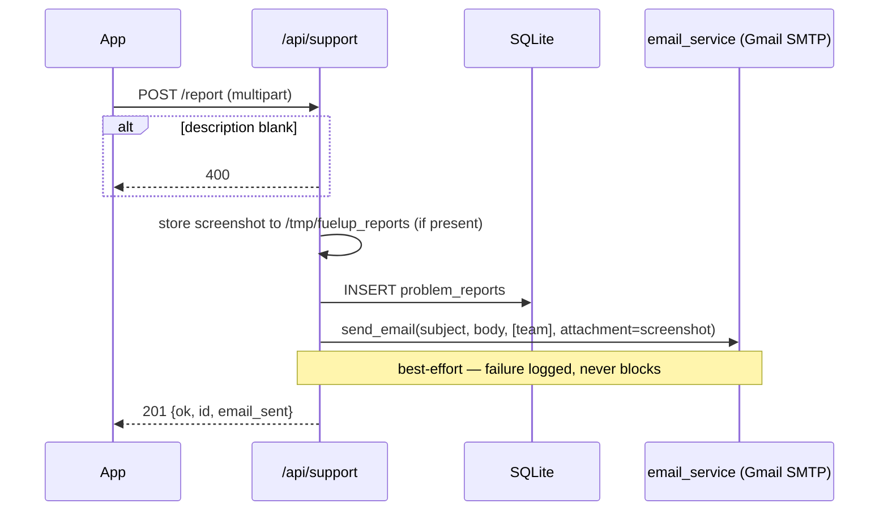

**Design rules:**
- **Report persists regardless of email outcome** — the DB insert + `201` happen first; email is best-effort. This closes a prior gap where the form POSTed to a non-existent endpoint (405) and silently dropped every report.
- **Email** — `email_service.send_email()` uses Gmail SMTP (`smtplib.SMTP_SSL`). Recipients are the team (`mayurkhera@gmail.com`, `purvihshah@gmail.com`). The screenshot is attached as an image; the body stays plain text. Returns `False` (no-op) if `GMAIL_USER`/`GMAIL_APP_PASSWORD` are unset — the report still saves.
- **Screenshot storage** — written to `/tmp/fuelup_reports` (ephemeral, same pattern as meal photos); the durable copy is the email attachment.

---

## 7. AI / ML Layer

There are **three distinct AI surfaces**, each backed by AWS Bedrock but with different system prompts, safety levels, and retrieval strategies.

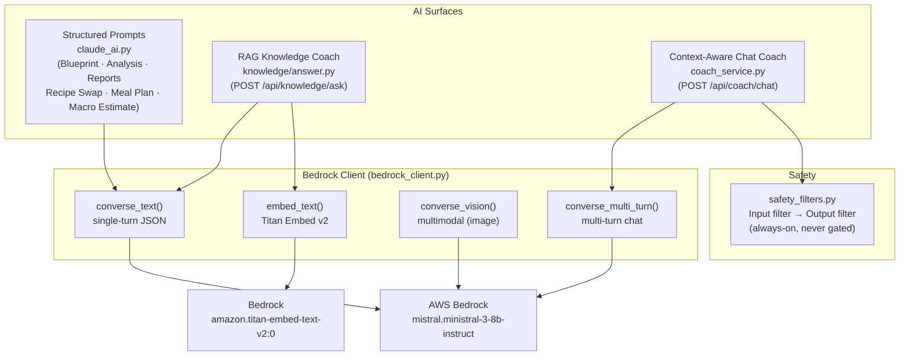

### 7.1 Bedrock Client (`bedrock_client.py`)

Single module wrapping the AWS Bedrock `converse` API. Key behaviours:

- **Model**: `mistral.ministral-3-8b-instruct` (overridable via `BEDROCK_MODEL_ID` env var)
- **Embed model**: `amazon.titan-embed-text-v2:0` (overridable via `BEDROCK_EMBED_MODEL_ID`)
- **Region**: `AWS_REGION` (default `us-east-1`)
- **Timeouts**: 30 s read, 10 s connect; **1 retry on transient failures** (e.g. throttling / 5xx), then fail
- **`is_configured()`**: returns True when any AWS credential source is present (`AWS_ACCESS_KEY_ID`, `AWS_PROFILE`, container role URI, web identity token, or role ARN)
- **`extract_json()`**: strips markdown code fences from model output before `json.loads()`
- **`_sanitize_json_string_literals()`**: escapes raw newlines/control chars inside JSON strings — guards against malformed model output
- **Vision**: `converse_vision()` accepts a base64 image and sends it as a Bedrock multimodal content block

### 7.2 Structured Prompts (`claude_ai.py`)

All structured prompts share a single `SCIENCE_SYSTEM` string that enforces the 7-source science framework and 15 key rules (Harris-Benedict ban, fat restriction ban, supplement prohibition for under-18, artificial dye ban, etc.). Every call returns **JSON only** — the system prompt ends with `"Respond ONLY with valid JSON."`.

| Prompt | Function | Tokens | Returns |
|---|---|---|---|
| 0 | `prompt0_athlete_blueprint` | 3000 | Full narrative blueprint (hero, RMR, macros, micronutrients, LEA warning) |
| 1 | `prompt1_nutrient_targets` | 1024 | Validated targets + explanation |
| 2 | `prompt2_meal_analysis` | 1500 | Traffic lights, fuel_score, gap_fix_suggestions, lea_alert |
| 3a | `prompt3_weekly_report` | 2000 | Parent weekly report (deprecated) |
| 3b | `prompt3_weekly_report_v2` | 900 | Structured report: grade_headline, what_went_well, critical_gap_why, next_week_tips |
| 4 | `prompt4_recipe_swap` | 1500 | 3 alternative recipe IDs from `recipes.json` |
| 5 | `prompt5_hydration` | 1024 | Hydration plan with weather context |
| 6 | `prompt6_weekly_meal_plan` | 2000 | Full 7-day recipe assignment plan |
| 7 | `prompt7_estimate_macros` | 512 | Macro estimates from free-text description |

`prompt0_athlete_blueprint` has a full mock fallback that returns a coherent response when Bedrock is unconfigured — so the app is functional for development without AWS credentials.

### 7.3 RAG Knowledge Coach (`knowledge/answer.py`)

The RAG coach answers open-ended sports nutrition questions from a **two-source hybrid retrieval**:

1. **Local knowledge base** — `knowledge_items` / `knowledge_chunks` tables, restricted to `review_status = 'approved'` and sourced only from approved organisations (Boston Children's Hospital, AAP, AAP HealthyChildren, ACSM, NIH, Sports Dietitians Australia, etc.)
2. **Live web search** — `search_approved_sites()` restricts results to approved organisation domains only; no open web

Retrieval uses Bedrock Titan embeddings (cosine similarity, `MIN_SCORE = 0.25`). Local hits and web hits are merged and re-ranked by score, returning the top 5 chunks.

The coach has a three-path **LLM router** that classifies each question before retrieval:

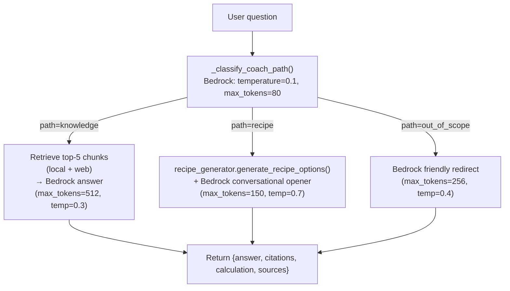

Key detail: the route is `POST /api/knowledge/ask`; the RAG coach is distinct from the chat coach.

### 7.4 Context-Aware Chat Coach (`coach_service.py`)

The chat coach (`POST /api/coach/chat`) is a **multi-turn conversation** scoped to a specific fueling window. Unlike the RAG coach, it builds context from live data — athlete profile, today's event, live weather — rather than a knowledge base.

Context assembled by `assemble_context()`:
- Athlete row from `athletes` table (name, age, gender, allergies, dietary restrictions, sweat profile, blueprint summary)
- Today's event from `events` table (event type, start time, city)
- Live weather via `get_weather(city)` — adds a `🌡️ HEAT ADVISORY` block if effective temperature ≥ 78°F
- Computed daily targets via `calc_daily_targets(athlete, event_type)`

`build_system_prompt()` assembles these into a single system prompt with:
- Persona: `athlete` (direct, motivating) or `parent` (supportive, educator tone)
- Current fueling window label and time
- Athlete calibration numbers (for the model only — rule 1 says never quote grams to the user)
- Allergy hard-stop block
- 8 mandatory rules including absolute stops for medical questions and weight/body-image topics

---

## 8. AI Coach — Input, Processing & Response

This section traces both AI coach surfaces end-to-end.

### 8.1 RAG Knowledge Coach (`POST /api/knowledge/ask`)

**Input gathering:**

The frontend sends:

```json
{
  "question": "What should I eat the night before a game?",
  "athlete_id": 42,
  "is_first_message": false,
  "history": [{"role": "user", "content": "..."}, {"role": "coach", "content": "..."}],
  "recipe_category": null,
  "prefer_recipe": false
}
```

The route handler fetches the full athlete row from SQLite and passes both to `answer_with_knowledge()`.

**Processing pipeline:**

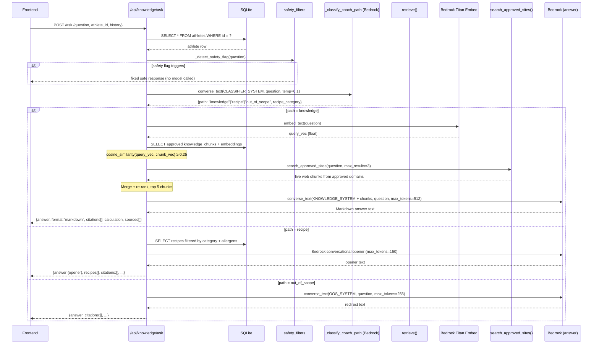

**Response format:**

```json
{
  "answer": "**Before a game, your main meal 3–3.5 hours prior is the most important window...**",
  "format": "markdown",
  "intent": "knowledge",
  "citations": [
    {
      "title": "Game Day Fueling",
      "source": "Boston Children's Hospital",
      "organization_url": "https://www.childrenshospital.org/...",
      "url": "https://...",
      "heading": "Pre-game nutrition"
    }
  ],
  "calculation": null,
  "sources": [...]
}
```

Citations are derived from the retrieved chunks — never invented. If no approved chunks score above 0.25, the response is a fixed fallback: `"I don't have enough approved information from our trusted sports nutrition sources to answer that confidently."`

### 8.2 Context-Aware Chat Coach (`POST /api/coach/chat`)

**Input gathering:**

The frontend first calls `GET /api/coach/context` to prefetch context (athlete, event, weather, targets) without making a model call. Then for each chat turn it sends:

```json
{
  "athlete_id": 42,
  "window_key": "pre_game_main",
  "window_label": "Gas Tank Meal",
  "window_time": "3–3.5 hrs before",
  "category_key": "pre_game",
  "category_label": "Pre-Game Fueling",
  "plan_date": "2026-06-21",
  "persona": "athlete",
  "messages": [
    {"role": "user", "content": "What's a good pasta option?"},
    {"role": "assistant", "content": "Great choice — pasta is exactly right..."},
    {"role": "user", "content": "How much should I eat?"}
  ]
}
```

**Processing pipeline:**

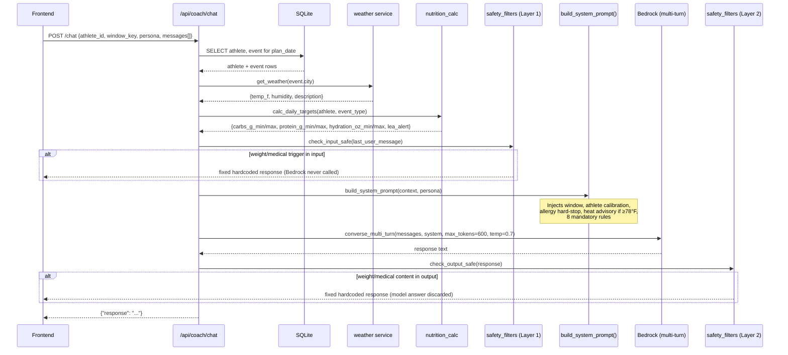

### 8.3 Two-Layer Safety Filter

Safety is enforced at **both the input and output layers** on every AI surface that returns free text to a minor. The filter is always-on with no environment variable gate.

**Layer 1 — Input filter** (`check_input_safe`): Runs before any model call. Pattern-matches the user's message against two trigger lists:

- `WEIGHT_INPUT_TRIGGERS`: 28 phrases covering weight loss, calorie cutting, body-image restriction
- `MEDICAL_INPUT_TRIGGERS`: 60+ phrases covering injuries, acute emergencies, eating disorders

If triggered: returns a fixed hardcoded response and **the model is never called**.

**Layer 2 — Output filter** (`check_output_safe`): Runs after the model responds, before returning to the client. Pattern-matches the model's output against:

- `WEIGHT_OUTPUT_TRIGGERS`: 10 paraphrase-aware phrases for weight-loss/restriction content
- `MEDICAL_OUTPUT_TRIGGERS`: 40+ phrases covering diagnoses, injury protocols (ice, compression, medication), prognosis

If triggered: the model's response is **discarded** and a fixed safe response is returned instead.

Neither layer can be disabled. The model's own system-prompt rules (rules 5 and 6 in the coach) are a secondary reinforcement, not the primary safety mechanism.

---

## 9. Data Layer

### 9.1 Database Schema

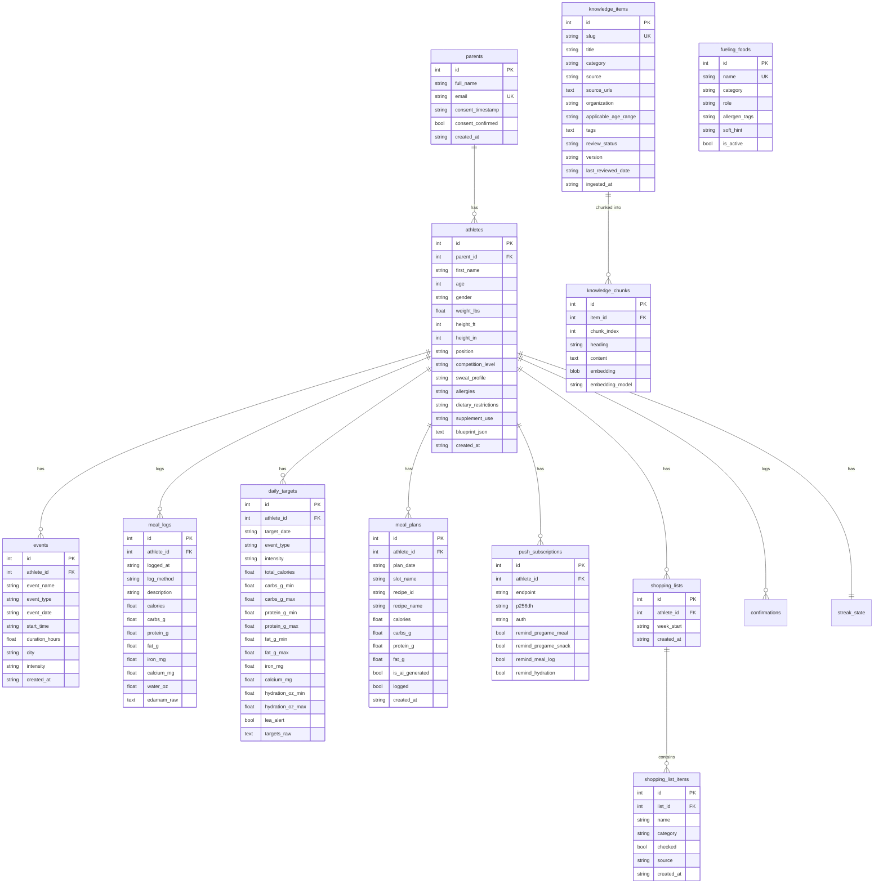

**Streak tables:**

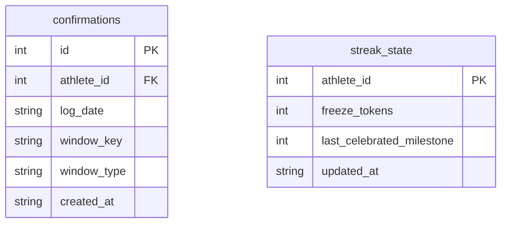

Additional tables not shown: `water_logs`, `otp_codes`, `legal_documents`, `athlete_food_prefs`, `food_submissions`, `notification_log`, `articles`, `athlete_article_picks`, `athlete_logins`, `meal_plan_selections`, `problem_reports`.

**Support table:**

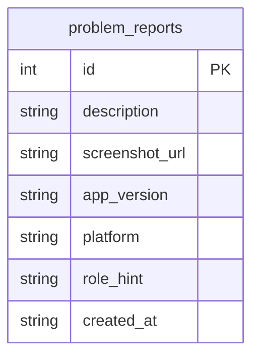

`problem_reports` is standalone (no FK) — the app sends no user ID, only a `role_hint`. Created by `_create_problem_reports()` in `db_migrations.run_all()`.

### 9.2 Data Access Pattern

All queries use `conn.execute("... WHERE id = ?", (id,))` with positional parameters — no string interpolation, no ORM. `row_factory = sqlite3.Row` gives dict-like column access. Foreign key constraints are enabled on every connection. In-memory databases (test mode) use `check_same_thread=False` and a `?mode=memory&cache=shared` URI.

### 9.3 Recipe Library

`api/data/recipes.json` — 164 curated recipes loaded at startup into a global `RECIPES` list by `recipe_db.py`. Schema per recipe:

```json
{
  "id": "R001",
  "name": "Power Pasta Bowl",
  "category": "pre-game",
  "timing": "3hrs before game",
  "ingredients": "Pasta, tomato sauce, grilled chicken, parmesan, spinach, milk",
  "macros": {"calories": 650, "carbs_g": 85, "protein_g": 45, "fat_g": 12},
  "dietary": ["halal-adaptable"],
  "allergens": ["gluten", "dairy"]
}
```

`recipe_db.py` provides `get_valid_recipes(profile, athlete)` which filters by timing category and excludes recipes whose `allergens` overlap the athlete's allergy list.

### 9.4 Food Catalog

`fueling_foods_seed.csv` — 90 items across 5 categories (`breakfast`, `pre_fuel`, `recovery`, `hydration`, `dinner_staple`). Each row: `name, category, role, allergen_tags, soft_hint`. The seeder upserts on `name` — re-running `db/setup.py` is safe and additive.

---

## 10. Nutrition Science Layer

`nutrition_calc.py` is the single source of truth for all numeric targets. It never calls any AI model.

### RMR Formula (Everett MD 2025 — PRIMARY)

```
Girls:  RMR = 11.1 × wt_kg + 8.4 × ht_cm − 537
Boys:   RMR = 11.1 × wt_kg + 8.4 × ht_cm − 340
```

Harris-Benedict is explicitly prohibited throughout the system.

### Physical Activity Level Multipliers

| Event Type | PAL |
|---|---|
| Rest | 1.55 |
| Practice / Training / Strength | 1.85 |
| Game | 2.00 |
| Tournament | 2.05 |

`total_calories = RMR × PAL`

### Carbohydrate Targets (g / kg body weight)

| Event Type | Range |
|---|---|
| Rest | 4–5 |
| Practice / Training / Strength | 6–8 |
| Game | 8–10 |
| Tournament | 10–12 |

### Protein Targets (g / kg body weight)

| Event Type | Range |
|---|---|
| Rest | 1.2–1.4 |
| Practice / Training | 1.4–1.6 |
| Strength | 1.8–2.0 |
| Game | 1.6–1.8 |
| Tournament | 1.8–2.0 |

### 10.4 Intensity Band Positioning

When an event has an `intensity`, `calc_daily_targets()` positions carbohydrate and protein targets **within** the scientifically valid band for the event type — never outside it. The `_reposition(lo, hi, intensity)` function:

| Intensity | Carb & protein range used |
|---|---|
| `low` | Lower half of the band (`lo` → `lo + 0.5 × span`) |
| `medium` | Middle 50% of the band (`lo + 0.25 × span` → `hi − 0.25 × span`) |
| `high` | Upper half of the band (`lo + 0.5 × span` → `hi`) |

When `intensity` is `None` (blueprint generation, legacy calls), the full band is returned unchanged — no backward compatibility break.

### Micronutrient Targets

| Nutrient | Target |
|---|---|
| Iron — girls | 15 mg / day |
| Iron — boys | 11 mg / day |
| Calcium | 1,300 mg / day (all athletes 9–17) |
| Magnesium | 240 mg/day (age 9–13) · 360 mg/day (girls ≥14) · 410 mg/day (boys ≥14) |
| Vitamin D | 1,000 IU / day |

### LEA Alert

`total_calories < 30 kcal / kg fat-free mass` (fat-free mass estimated at 85% of body mass) triggers a LEA (Low Energy Availability) alert — classified as a medical-level concern. The blueprint surfaces a direct parent warning and refers to a registered dietitian.

---

## 11. Frontend Architecture

The React SPA lives in `frontend/src/` and is built by Vite to `frontend/dist/`, which FastAPI serves as static files.

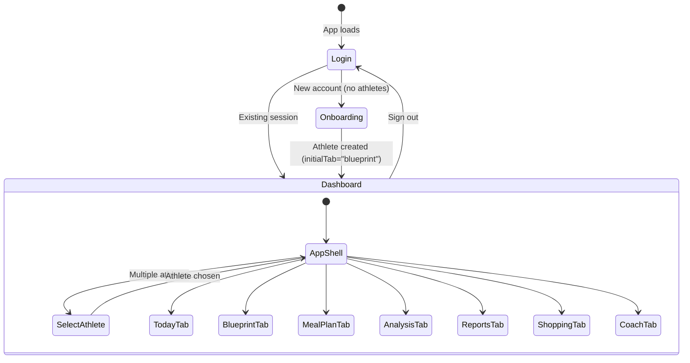

Key design decisions:
- **No router library**: top-level view state is a `useState` string (`"login"` / `"onboarding"` / `"dashboard"`)
- **`const API = import.meta.env.VITE_API_URL ?? ""`**: all fetch calls are `${API}/api/...`. In production `VITE_API_URL` is unset so calls are same-origin
- **Admin route**: `window.location.pathname === "/admin/library"` renders `LibraryAdmin` component directly
- **Blueprint polling**: after athlete creation, the Blueprint tab polls `GET /api/athletes/{id}/blueprint` until `__status` sentinel disappears
- **Add Event form**: parent selects `event_type` then a **required** intensity dropdown (`Low / Medium / High`). Form blocks submission until intensity is chosen. ICS imports bypass this UI and derive intensity silently on the backend.
- **Competition Level** (Onboarding + Profile): three-tier dropdown — Recreational / Competitive Club / Elite Club — with inline examples to aid selection.
- **Streak strip (mobile)**: `StreakStrip.tsx` renders as the first child of the Today screen's `ScrollView`. It reads the `streak` block from `useTodayView`; guards against `undefined` with an early return. After a window confirm, `handleConfirm` reads `body.streak.just_reached_milestone` and fires haptic + toast if a milestone was crossed.

---

## 12. Push Notifications

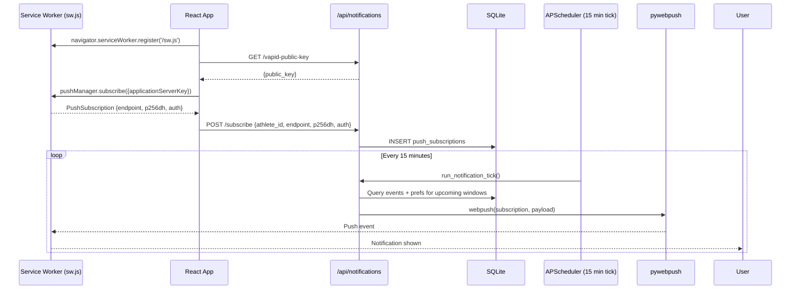

VAPID keys are stored as Fly.io secrets (`VAPID_PRIVATE_KEY`, `VAPID_PUBLIC_KEY`). The service worker (`frontend/public/sw.js`) handles push events and shows notifications using the Web Push API. Expo push tokens for mobile are stored in the same `push_subscriptions` table alongside web subscriptions.

Notification types (per-athlete preferences in `push_subscriptions`): `remind_pregame_meal`, `remind_pregame_snack`, `remind_meal_log`, `remind_hydration`.

---

## 13. CI / CD Pipeline

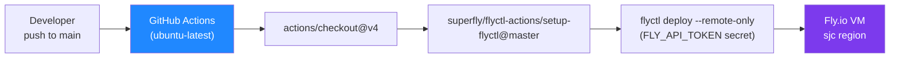

- **Trigger**: every push to `main`
- **Concurrency group**: `deploy-group` — only one deploy runs at a time; earlier runs are not cancelled (default `cancel-in-progress: false`)
- **Remote-only**: the Docker build happens on Fly.io infrastructure, not in the GitHub Actions runner
- **DB migration**: `fly ssh console -a fuelup-youth -C "python db/setup.py"` must be run manually after schema changes; it is not part of the automated deploy

---

## 14. Security & Compliance

| Concern | Implementation |
|---|---|
| **CORS** | `allow_origins=["*"]` — open for now; appropriate for a development-stage app |
| **SQL injection** | All queries use parameterised `?` placeholders; no string interpolation |
| **OTP security** | Code stored as `code_hash` (hashed); expires in 10 min; single-use; rate-limited to 1 OTP per 60 s per parent |
| **Admin routes** | Knowledge ingest and food submission approval require `X-Admin-Key` header matching `KNOWLEDGE_ADMIN_KEY` env var |
| **Secrets** | AWS credentials, VAPID keys stored as Fly.io secrets; never in source code |
| **AI safety — minors** | Two-layer always-on safety filter (Section 8.3); absolute stops for weight/body-image and medical content; fixed hardcoded responses, not model-generated |
| **Medical disclaimer** | `"Fueling2Win provides educational food guidance — not medical nutrition therapy."` embedded in every AI prompt, API `/info` endpoint, blueprint response, and weekly report |
| **Supplement prohibition** | Hardcoded in `SCIENCE_SYSTEM` and coach system prompt: never recommend supplements, creatine, caffeine, or energy drinks to any athlete under 18 |
| **Data residency** | All user data in SQLite on the Fly.io VM; no third-party data processor except AWS Bedrock for inference |
| **LEA flag** | Calories below 30 kcal/kg FFM trigger a mandatory parent-facing warning and RD referral — safety check is computed in Python (`nutrition_calc.py`), not delegated to the AI |

---

## 15. Streak Gamification

Streak gamification drives daily re-engagement for youth athletes on the Today screen. The design intentionally uses a **forgiving streak** (auto-freeze, no-shame empty state) to keep young athletes motivated rather than punished.

### 15.1 Design Philosophy

- **Today-first**: the athlete's primary action is confirming fueling windows (window confirm taps → `confirmations` table). The streak measures this, not meal logs.
- **Forgiving**: one auto-freeze token per rolling 7-day window bridges a single missed day so a streak survives an off-day.
- **Fast early hook**: first milestone fires at **day 2** — the earliest possible return visit — so a first-time user is celebrated immediately.
- **No shame**: `current = 0` renders an encouraging empty state ("Start your first streak today"), not a failure message.

### 15.2 Qualifying Signal

`streak_service._qualifying_dates(athlete_id, conn)` returns the union of two sources:

| Source | Table | Threshold |
|---|---|---|
| Window confirms (primary) | `confirmations` | ≥ `streak_min_confirms_per_day` (default 1) per calendar date |
| Window engine logs (secondary) | `window_logs` | Any log for the date |

The union ensures legacy data sources don't invalidate existing streaks.

### 15.3 Streak Computation (`compute_current_streak`)

The algorithm walks backwards from today (with today-grace — today always counts as potentially qualifying):

```
today-grace → anchor = today if today ∈ qual else yesterday
walk d = anchor backwards:
  ∈ qual      → streak++, commit pending_bridges to bridges_used, continue
  gap day     → if (bridges_used + pending_bridges) < max_bridges AND d ≥ today−6:
                    pending_bridges++, continue   ← freeze attempted but NOT yet counted
                else: break
```

**Key invariant — `pending_bridges` pattern**: a bridge is only committed to `bridges_used` when a real qualifying day follows the gap. This prevents `freeze_used_this_week = True` for athletes who only have one qualifying day (today) but no history.

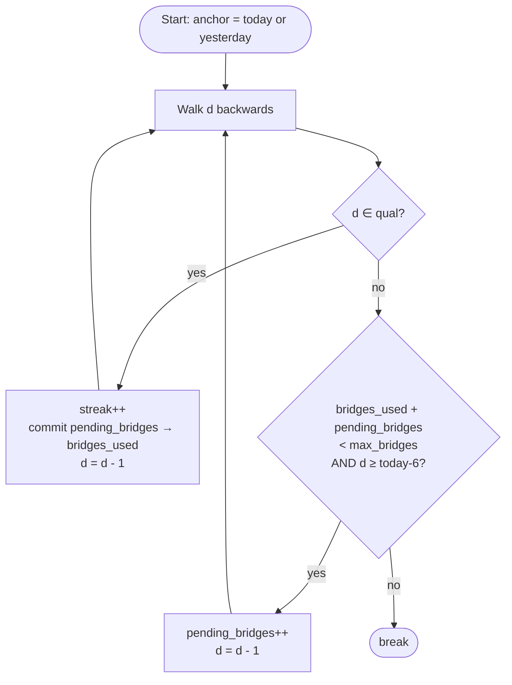

### 15.4 Streak Block Shape

`get_streak()` returns:

```json
{
  "current": 7,
  "best": 14,
  "week_strip": [true, true, false, true, true, true, true],
  "today_done": true,
  "freeze_used_this_week": false,
  "next_milestone": 10,
  "just_reached_milestone": null
}
```

`register_confirmation()` (write path, called after every window confirm) returns the same shape but may have `just_reached_milestone` set to a non-null value when the athlete climbs into a new milestone tier.

### 15.5 Milestone Ladder

| Milestone | Days | Intent |
|---|---|---|
| 🔥 | 2 | Earliest possible return visit — hooks immediately |
| 🔥🔥 | 5 | One school week |
| 🔥🔥🔥 | 10 | Two weeks solid |
| 🔥🔥🔥🔥 | 21 | Habit formation threshold |

`last_celebrated_milestone` in `streak_state` prevents re-firing for a milestone already celebrated. If the streak drops below a tier then climbs back, the milestone fires again.

### 15.6 Freeze Token

- Default: **1 token** per athlete (stored in `streak_state.freeze_tokens`)
- Rolling window: can only be consumed in the last 7 calendar days relative to today
- MVP: token replenishes each calendar week automatically (no explicit replenishment call — the rolling window resets naturally)
- Phase 2 (not yet built): earned or purchasable bonus tokens; coach-recommended freeze grant

### 15.7 Mobile UI — StreakStrip

`components/today/StreakStrip.tsx` renders above all other Today content:

```
🔥 7  day fuel streak      Best: 14
● ● ○ ● ● ● ●            (Mon–Sun dots)
[❄️ One freeze used this week]       ← only if freeze_used_this_week
```

On milestone: `Haptics.NotificationFeedbackType.Success` + toast `"7-day streak! You're on fire 🔥"`.

### 15.8 Backend Components

| File | Role |
|---|---|
| `api/services/streak_service.py` | Single source of truth — all streak reads and writes |
| `api/services/db_migrations.py` | `_create_streak_state()` wired into `run_all()` |
| `api/routes/fuel_report.py` | `record_confirmation` returns `{...row, "streak": streak}` |
| `api/services/today_service.py` | `build_today_view` includes `"streak": get_streak(...)` |
| `tests/test_streak_service.py` | 16 tests including phantom-freeze regression |

### 15.9 Phase 2 (Out of Scope for MVP)

- Push nudge: "You're on a 6-day streak — don't break it tonight!" via APScheduler tick
- Earned freeze tokens for Perfect Days (all windows confirmed)
- Leaderboard (requires child-safety review before implementation)
- "Perfect Day" bonus layer stacked on top of the streak count

---

*Document generated from source: `/Users/mayurkhera/FuelUpYouth`. All technical claims are derived directly from the codebase as of 2026-06-22.*
