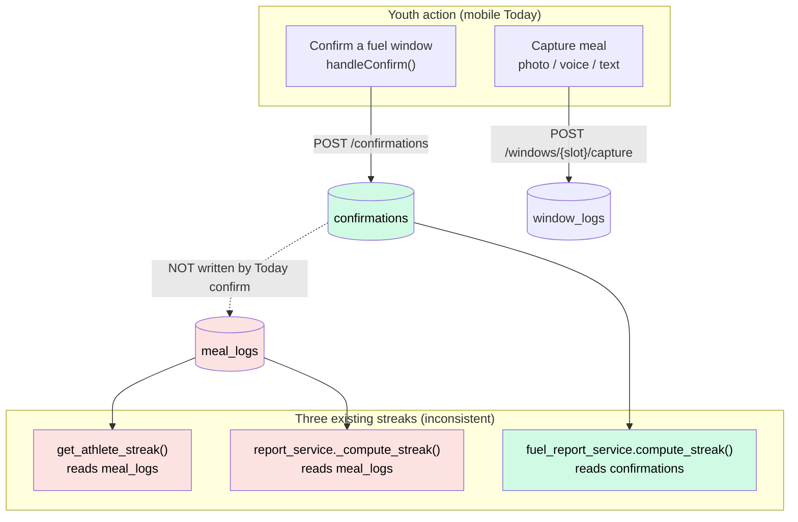
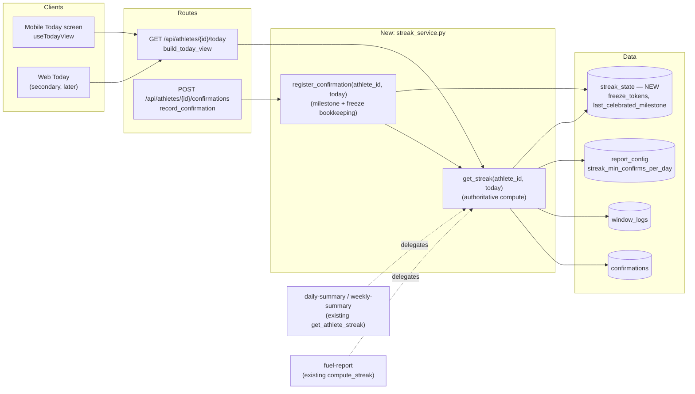
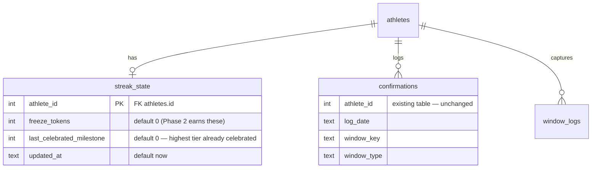

# FuelUp — Streak Feature Design

**Version:** 0.1 (Draft for Review)
**Date:** 2026-06-21
**Author:** Principal Engineering review
**Status:** ✅ Design approved 2026-06-21 — implementation plan to follow
**Scope:** MVP streak for the **Youth athlete**, displayed on the **Today screen**. Parent surfaces are out of scope for v1.

> **Approved decisions (2026-06-21):**
> - **Mechanic:** Option 2 — Forgiving Fuel Streak.
> - **D1 — qualifying day:** a day with ≥1 confirmed fuel window (`streak_min_confirms_per_day` = 1).
> - **D2 — display:** show `🔥 N` count + 7-dot week strip **below** the number-free hero.
> - **D3 — freeze:** include one auto-applied freeze per rolling 7 days in the MVP.
> - **D4 — source of truth:** `confirmations` ∪ `window_logs` (confirmations primary).
> - **Milestone ladder:** **2 / 5 / 10 / 21** days (tighter early hook).

---

## 1. Goal

Keep the **youth athlete** coming back to the app daily. Parents are already highly engaged (they read notifications, manage the schedule); the retention risk is the teen. Streaks are a familiar, low-friction, dopamine-friendly mechanic that teens already understand from Duolingo, Snapchat, BeReal, etc.

**Success criteria for v1:**
- A streak is visible on the Today screen the moment the athlete opens the app.
- Completing a daily fuel action visibly advances the streak (immediate feedback).
- The mechanic is **forgiving** — a single missed day never shames the teen (hard product constraint, see §3).
- The data model leaves clean seams for Phase 2 (freezes, push nudges, milestones, leaderboards) without a rebuild.

---

## 2. Current State — What Already Exists

This is the single most important input to the design. **A streak primitive already exists in the codebase — three separate times — and they disagree with each other.** Any new work must consolidate, not add a fourth.

| # | Function | Source table | "A day counts when…" | Where it surfaces |
|---|---|---|---|---|
| 1 | `today_service.get_athlete_streak()` | `meal_logs` | ≥1 row for that date | `/api/athletes/{id}/daily-summary`, `/weekly-summary` |
| 2 | `report_service._compute_streak()` | `meal_logs` | ≥1 row for that date | legacy weekly report |
| 3 | `fuel_report_service.compute_streak()` | `confirmations` | confirmations ≥ `streak_min_confirms_per_day` (config, default 1) | Fuel Report v2 (`/fuel-report`) |

### The critical disconnect

The mobile Today screen's confirm button (`handleConfirm` in `app/(app)/today/index.tsx`) writes to the **`confirmations`** table via `POST /api/athletes/{id}/confirmations`. It does **not** write to `meal_logs`.

Therefore streak implementations **#1 and #2 (meal_logs-based) do not reflect what the youth actually does on the Today screen.** Only **#3 (confirmations-based)** does. Two of the three "streaks" would sit at zero for a normally-active mobile athlete.

### Assets we can reuse

- **`confirmations` table** — `(athlete_id, log_date, window_key, window_type)`, `UNIQUE(athlete_id, window_key, log_date)`, indexed on `(athlete_id, log_date)`. Already the true record of a youth completing a fuel window.
- **Config key `streak_min_confirms_per_day`** (default `1.0`) — already defined in `report_config`; intended to gate streak qualification but currently only honoured by impl #3.
- **`get_athlete_streak()` already returns a `week_logged[7]` boolean array** — a Mon–Sun "did they engage" strip. This is exactly the visual building block for a week dot-strip on Today.
- **`window_logs` table** — the photo/voice/text capture path (`POST .../windows/{slot}/capture`) writes here. Some athletes complete windows via capture rather than the confirm tap. See Decision D4.

### Where it must be displayed

The youth Today screen is the **mobile** app (`app/(app)/today/index.tsx`), which renders from `GET /api/athletes/{id}/today` (`build_today_view`). **`build_today_view` does not currently return any streak data.** That is the gap to close. (The web `frontend/src/pages/Today.jsx` is a secondary consumer of the same backend and can render the same streak block later.)



> **Takeaway:** The green path (`confirmations`) is the real youth signal. The design consolidates all streak logic onto it and surfaces it on the Today screen.

---

## 3. Constraints That Shape the Design

These are hard rules pulled directly from the codebase and the mobile `CLAUDE.md`. They are not negotiable and they meaningfully narrow the design space.

| # | Constraint | Source | Design impact |
|---|---|---|---|
| C1 | **Today tab shows no nutrition score / macro number / ring. Ever.** | mobile CLAUDE.md §14.4, §19 | A *streak day-count* is a different kind of number (consistency counter, not a nutrition metric). Still — this needs an explicit ruling. See **Decision D2**. |
| C2 | **All copy positive / win-framed. Banned: missed, behind, deficit, failed, warning, lacking, critical.** | mobile CLAUDE.md §14.5 | "You lost your streak" / "Don't break your streak" are **forbidden**. Forgiveness + comeback framing is mandatory, not optional. |
| C3 | **Max 5 confirmation taps per day; 1–5 fuel windows/day.** | window-engine guardrail | A streak "day" is binary (engaged / not). Don't gate the streak on completing *all* windows by default — busy days would break it constantly (fights C2 + the retention goal). |
| C4 | **Rest days still need fuel** (rest-day mission items exist). | `today_service.get_mission_items()` | Rest days can legitimately count toward the streak. But forgiveness (D3) protects the teen who genuinely skips. |
| C5 | **Python computes all numbers; Claude/static copy writes words.** | mobile CLAUDE.md §14.1 | Streak counts, milestones, freezes = pure Python in a service. Any motivational sentence = static positive template or existing copy layer. No LLM needed for v1. |
| C6 | **Migrations are additive only** (`CREATE TABLE IF NOT EXISTS`, `INSERT OR IGNORE`), wired in `db_migrations.run_all()`. | `api/services/db_migrations.py` | Any new table follows this exact pattern. No destructive migration. |
| C7 | **Child safety / two personas; every write stamped, visibility server-side.** | mobile CLAUDE.md §12, §15 | Streak is per-athlete, parent-visible by default. No new PII. No social/leaderboard in v1 (would introduce cross-child exposure). |
| C8 | **Timezone invariant: completion uses the client's local date**, not server UTC. | mobile CLAUDE.md §19 | The streak service must compute "today" from the client-supplied `log_date` / `date`, never `date.today()` alone. |

---

## 4. Key Decisions (the approval gate)

I need your ruling on these four before writing the implementation plan. My recommendation is bolded.

- **D1 — What counts as a "streak day"?** → drives the three options in §5. **Recommend: a day with ≥1 confirmed fuel window** (`streak_min_confirms_per_day`, already = 1).
- **D2 — May the streak count appear as a number on Today?** The "no number" rule (C1) targets *nutrition* scores. A streak counter is a consistency signal, not a calorie/macro/readiness number. **Recommend: yes — show "🔥 N" and a 7-dot week strip, placed *below* the no-number hero, never inside it.** Fallback if you want to honour C1 literally: show the flame + week dots with no numeral.
- **D3 — Forgiveness mechanic?** Given C2 (no shame). **Recommend: (a) `best_streak` is always preserved and shown so a reset never erases their achievement, and (b) one auto-applied "streak freeze" protects a single missed day per rolling 7 days.** Defer earned/purchasable freezes to Phase 2.
- **D4 — Streak source of truth: `confirmations` only, or `confirmations` ∪ `window_logs`?** Some athletes complete windows by capture (`window_logs`) rather than the confirm tap. **Recommend: count a day if it has a `confirmations` row OR a `window_logs` row** — robust to which path the athlete used, at near-zero extra cost. `confirmations` remains primary.

---

## 5. Options for the Streak Mechanic

Three coherent options. Each is a different answer to D1.

### Option 1 — Daily Fuel Streak (simple consecutive days)
- **Rule:** streak = consecutive days each having ≥1 confirmed fuel window.
- **Today UI:** flame + count, plus the 7-dot Mon–Sun week strip (reuses `week_logged`).
- **Forgiveness:** `best_streak` preserved; a fully-missed day resets current to 0.
- **Effort:** Small. Pure consolidation of existing pieces.
- **Risk:** A single missed day → back to zero. For a busy teen this can feel punishing (brushes against C2's spirit) and is the classic reason streaks *lose* users.

### Option 2 — Forgiving Fuel Streak (consecutive days + freeze + milestones) ✅ Recommended
- **Rule:** same qualifying day as Option 1.
- **Plus:** one auto-freeze protects a single missed day per rolling 7 days; `best_streak` always preserved and celebrated; milestone moments at **2 / 5 / 10 / 21** days (haptic + toast + a small badge).
- **Today UI:** flame + count + week strip + (on the day they cross a tier) a one-time celebration moment.
- **Effort:** Medium. Adds one tiny `streak_state` table as the future-ready seam.
- **Why it wins:** directly targets the "busy teen misses one day and churns" failure mode, is fully no-shame compliant (C2), and the `streak_state` table is the exact building block Phase 2 needs (push nudges via the existing 15-min tick, earned freezes, leaderboards).

### Option 3 — Goal-Completion Streak (complete the whole day)
- **Rule:** streak increments only when the athlete completes **all** of the day's fuel windows.
- **Today UI:** ring/checklist completion + streak.
- **Effort:** Medium.
- **Risk:** High daily break rate (game days can have 5 windows). Directly fights C2 and the retention goal. **Not recommended** for v1; can become an optional "Perfect Day" *bonus* layer in Phase 2 on top of Option 2.

**Recommendation: Option 2**, built as a focused MVP slice (freeze + 4 milestone tiers + week strip), with the full economy deferred.

---

## 6. Recommended Design (Option 2, MVP slice)

### 6.1 Streak definition (Python, deterministic)

```
qualifying_day(d) := (≥1 confirmations row for d)  OR  (≥1 window_logs row for d)     # D4
                     where count ≥ streak_min_confirms_per_day   (config, default 1)

current_streak := number of consecutive qualifying days ending today (or yesterday if
                  today not yet logged — today never breaks the streak until it ends),
                  with up to ONE non-qualifying day "frozen" per rolling 7-day window.   # D3

best_streak     := longest consecutive run ever (already computed by get_athlete_streak)
week_strip[7]   := Mon..Sun booleans for the current week (reuse week_logged)
```

All date math uses the **client local date** (C8): the service accepts a `today` parameter, exactly like `build_today_view(today=...)`.

### 6.2 Architecture — one service, consolidated

Create **`api/services/streak_service.py`** as the single source of truth. Delete the three ad-hoc implementations' logic by having them call the new service (keeps their return shapes for backward compatibility).



**Design principle (cache vs truth):** `current_streak` / `best_streak` are **always computed** from `confirmations`/`window_logs` — they are never trusted from a cache, so they can never drift. The new `streak_state` table stores **only what cannot be derived**: `freeze_tokens` and `last_celebrated_milestone` (so a milestone celebration fires exactly once). This is the minimal future-ready seam.

### 6.3 Data model — one new table



Migration follows the additive pattern in `db_migrations.run_all()`:

```python
def _create_streak_state(conn):
    conn.execute("""
        CREATE TABLE IF NOT EXISTS streak_state (
            athlete_id                INTEGER PRIMARY KEY REFERENCES athletes(id),
            freeze_tokens             INTEGER NOT NULL DEFAULT 0,
            last_celebrated_milestone INTEGER NOT NULL DEFAULT 0,
            updated_at                TEXT    NOT NULL DEFAULT (datetime('now'))
        )
    """)
```

No change to `confirmations`, `window_logs`, `meal_logs`, or any existing table.

### 6.4 API contract — extend `/today`

`build_today_view()` gains one new top-level key, `streak`. **No new endpoint, no new client round-trip.**

```jsonc
// GET /api/athletes/{id}/today  →  (additive field)
"streak": {
  "current": 5,                 // consecutive qualifying days
  "best": 12,                   // best ever — never erased
  "week_strip": [true,true,false,true,true,false,false],  // Mon..Sun
  "today_done": true,           // is today already a qualifying day
  "freeze_used_this_week": false,
  "next_milestone": 10,         // next tier (2/5/10/21) or null
  "just_reached_milestone": null // e.g. 5 on the tap that crosses it, else null
}
```

The milestone-celebration flag (`just_reached_milestone`) is set on the **write path** (the confirmation POST), not invented on read, so the celebration fires once and exactly when the athlete acts.

### 6.5 Runtime flow — confirm → streak advances → Today updates

```mermaid
sequenceDiagram
    participant Youth
    participant Today as Mobile Today screen
    participant RConfirm as POST /confirmations
    participant Streak as streak_service
    participant DB as SQLite
    participant RToday as GET /today

    Youth->>Today: Tap "Confirm" on a fuel window
    Today->>Today: Optimistic mark done + haptic + toast (existing)
    Today->>RConfirm: POST {window_key, window_type, log_date}
    RConfirm->>DB: INSERT OR IGNORE INTO confirmations
    RConfirm->>Streak: register_confirmation(athlete_id, log_date)
    Streak->>DB: compute current_streak (confirmations ∪ window_logs)
    Streak->>DB: read streak_state (freeze_tokens, last_celebrated_milestone)
    alt current_streak crosses a 2/5/10/21 tier
        Streak->>DB: UPDATE streak_state.last_celebrated_milestone
        Streak-->>RConfirm: {just_reached_milestone: 5}
    else no new tier
        Streak-->>RConfirm: {just_reached_milestone: null}
    end
    RConfirm-->>Today: confirmation row (+ optional milestone hint)
    Today->>RToday: refetch today
    RToday->>Streak: get_streak(athlete_id, log_date)
    Streak-->>RToday: streak block
    RToday-->>Today: TodayView incl. streak
    Today->>Youth: Flame count ticks up; week dot fills; milestone celebration if any
```

### 6.6 Today screen UI (youth)

Placement and copy honour C1–C2.

- **A slim streak strip directly under `ReadinessHero`** (which itself stays number-free):
  - `🔥 5` day count (per D2) + label "day fuel streak"
  - 7 dots Mon–Sun: filled = fueled, hollow = not yet, a small "snowflake" dot = freeze-protected.
  - When `current == 0`: no shame — copy reads *"Start your streak today"* with an empty strip (banned words avoided per C2).
- **Milestone moment** (`just_reached_milestone`): reuse the existing toast + `expo-haptics` success pattern already used by `handleConfirm`; show a one-line celebratory badge (e.g. *"5-day streak! You're on fire."*). Static positive copy — no LLM.
- **`best_streak`** shown subtly ("Best: 12") so a reset never feels like total loss.

> Numbers shown here are **streak/consistency counters**, never calories/macros/readiness — consistent with the spirit of C1. Final call is **Decision D2**.

### 6.7 Notifications (Phase 1.5, optional)

The 15-minute APScheduler tick (`run_notification_tick`) is an existing seam. A future "your streak is alive — log before midnight" nudge can read `streak_state` + today's qualifying status with no new infrastructure. **Recommend deferring** to keep v1 tight; the table makes it a small follow-up. (Any such nudge must still obey C2 — encouragement, never "don't lose it" loss-framing.)

---

## 7. Scope — In vs Out (YAGNI)

**In (MVP / v1):**
- `streak_service.py` consolidating all streak logic onto `confirmations ∪ window_logs`.
- `streak_state` table (freeze_tokens, last_celebrated_milestone).
- One auto-freeze per rolling 7 days.
- Milestone tiers 2 / 5 / 10 / 21 with a one-time celebration moment.
- `streak` block added to `GET /today`; Today screen strip + week dots + celebration.
- Existing `get_athlete_streak` / `compute_streak` delegate to the new service (no behavioural regressions).

**Out (Phase 2+, intentionally deferred):**
- Earned / purchasable freezes, freeze economy UI.
- Push "keep your streak" nudges.
- Leaderboards, friends, social compare (child-safety review required first — C7).
- "Perfect Day" goal-completion bonus layer (Option 3 as an *additive* bonus).
- Parent-facing streak surfaces / streak in the weekly Fuel Report copy.
- Points / XP / levels.

---

## 8. Risks & Mitigations

| Risk | Mitigation |
|---|---|
| Streak count is a "number on Today," conflicting with C1 | Explicit **Decision D2**; recommended placement is below the number-free hero; fallback is a numeral-free flame + dots. |
| Loss-aversion framing slips into copy (C2 violation) | All streak copy is static, reviewed, win-framed; `best_streak` always preserved; "start your streak today" replaces any "you lost it." |
| Cache drift between stored and real streak | `current`/`best` are **always recomputed**; `streak_state` stores only non-derivable freeze/milestone state. |
| `confirmations` vs `window_logs` double-source confusion | D4 union rule; `confirmations` is primary, `window_logs` is an OR fallback — a day counts once regardless. |
| Timezone double-count / next-day pre-fill | Reuse the established client-`log_date` invariant (C8); service takes `today` as a parameter. |
| Three existing streaks diverge further | Consolidate now — existing callers delegate to `streak_service`. |

---

## 9. Decisions — Resolved (2026-06-21)

1. **D1–D4 (§4)** — confirmed as recommended.
2. **Milestone tiers** — **2 / 5 / 10 / 21** (tighter early hook chosen over 3 / 7 / 14 / 30).
3. **Freeze in MVP** — included (one auto-freeze per rolling 7 days).
4. **Surface** — mobile Today only for v1; web Today + parent surfaces deferred to Phase 2.

---

*Approved. The hand-off-ready implementation plan lives at `docs/superpowers/plans/2026-06-21-youth-streak.md`.*
