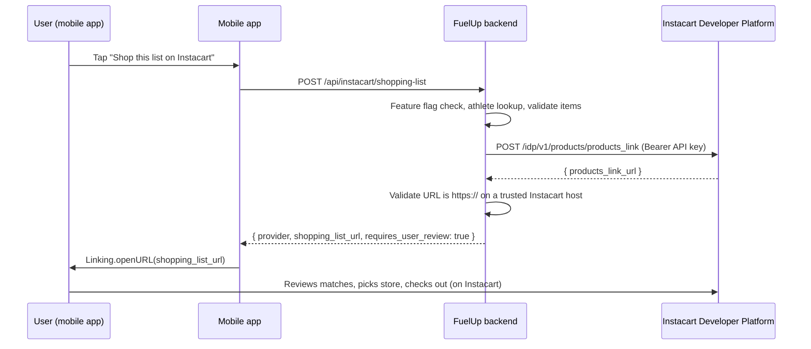

# Instacart shopping-list handoff

Lets a family send their grocery list to Instacart and get back a link to a
ready-made Instacart shopping list page. We never touch an existing Instacart
cart, never see their Instacart credentials, and never confirm a checkout —
Instacart owns that entire experience.

## Supported behavior

- Accepts a grocery list (title + items with name/quantity/unit/UPC/brand
  preference) from the mobile app.
- Creates an Instacart-hosted "shopping list page" via the Instacart Developer
  Platform's `POST /idp/v1/products/products_link` endpoint and returns its URL.
- The user opens that URL, Instacart searches its catalog for matching
  products, the user picks their own store, reviews/adjusts quantities and
  substitutions, and checks out **on Instacart**, using their own Instacart
  account.

## Unsupported behavior (do not imply otherwise in any copy)

- We cannot add items directly to an existing Instacart cart.
- We cannot pick the retailer/store for the user — Instacart's docs say
  "directing users to a specific merchant is not supported."
- We cannot guarantee an exact product/brand match, price, or availability.
- We cannot complete checkout on the user's behalf.
- We have no API-confirmed signal that an order was actually placed. The
  `instacart_handoff_feedback` table (see `api/routes/instacart_feedback.py`)
  is a self-reported survey, not an order-confirmation webhook — none exists
  in the documented API.

## Architecture

```
Mobile app (app/(app)/shopping/index.tsx)
  │  POST /api/instacart/shopping-list  { athlete_id, title, items[] }
  ▼
FastAPI route (api/routes/instacart.py)
  │  - feature flag check (404 if off)
  │  - athlete_id existence check
  ▼
Domain layer (api/services/instacart_shopping_list.py)
  │  - Pydantic validation (units, UPC format, item/name limits, dup checks)
  │  - maps our request → Instacart's documented schema
  │    (line_item_measurements, not the deprecated quantity/unit fields)
  ▼
Instacart client (api/services/instacart_client.py)
  │  - POST https://connect.instacart.com/idp/v1/products/products_link
  │  - Authorization: Bearer <INSTACART_API_KEY>   (server-side only)
  ▼
Instacart Developer Platform
  │  - returns { "products_link_url": "https://..." }
  ▼
Domain layer validates the URL is https:// on an instacart.com/instacart.tools host
  ▼
{ "provider": "instacart", "shopping_list_url": "...", "requires_user_review": true }
  ▼
Mobile app opens the URL via Linking.openURL — user finishes on Instacart
```

### Sequence diagram



The Instacart API key never leaves the backend — it is not in any response
body, log line, or client bundle.

## Key setup (human steps — cannot be done by an agent)

1. Apply for Developer Platform access via Instacart's business-developer
   page (`https://www.instacart.com/company/business/developers`). Expect
   roughly 30–40 days from access request to demo approval + production key,
   per Instacart's own published estimate.
2. Once approved, sign in at `dashboard.instacart.com` → API Keys → Create New
   API Key → choose **Development** first.
3. Copy the key immediately (Instacart only shows it once) and store it as a
   Fly.io secret — **never** in source, `.env` committed to git, tickets,
   chat, or logs:
   ```bash
   fly secrets set INSTACART_API_KEY="<the real key>" -a fuelup-youth
   ```
4. Repeat for a **Production** key once ready to launch; store it the same
   way (Fly secret, not committed anywhere).
5. Before any public mention of this integration (blog post, App Store copy,
   press), submit it to Instacart's developer-messaging review — allow 5
   business days (Legal/Comms/Disclosures).
6. To rotate: generate a new key in the dashboard, `fly secrets set` the new
   value, redeploy, confirm the new key works, then revoke the old key in the
   dashboard. To revoke immediately (suspected leak): revoke in the dashboard
   first, accept downtime, then rotate.

## Environment configuration

| Var | Purpose |
|---|---|
| `INSTACART_SHOPPING_LIST_ENABLED` | Feature flag. `false` until a real key is configured — ships dark. |
| `INSTACART_ENV` | `development` (default) → `connect.dev.instacart.tools`, `production` → `connect.instacart.com`. |
| `INSTACART_API_KEY` | Bearer token from the dashboard. Required whenever the flag is on. |
| `INSTACART_PARTNER_LINKBACK_URL` | Optional — our own URL shown as a link back to FuelUp on the Instacart page. Operator-configured only; never taken from a request body. |

Mobile: `constants/featureFlags.ts` → `INSTACART_SHOPPING_LIST_ENABLED` (client
gate for the button; independent of, and must be flipped alongside, the
backend flag).

## Local development / testing

1. `cp .env.example .env`, request a **development** API key (steps above),
   set `INSTACART_API_KEY` and `INSTACART_SHOPPING_LIST_ENABLED=true` locally.
2. `INSTACART_ENV` defaults to `development` → hits `connect.dev.instacart.tools`,
   never production.
3. Run the backend tests (no real Instacart calls — everything is mocked):
   ```bash
   source venv/bin/activate
   python -m pytest tests/test_instacart_shopping_list_mapping.py tests/test_instacart_shopping_list_route.py -q
   ```
4. Manual end-to-end check against Instacart's real dev sandbox (requires a
   real dev key): start the backend, flip the mobile feature flag on, tap
   "Shop this list on Instacart" from the Grocery List screen, confirm a
   `connect.dev.instacart.tools`-backed URL opens and shows the expected items.

## Production approval

Instacart's docs describe "demo approval" then a separate production key —
no further checklist is published beyond that. Do not invent additional
steps; if Instacart requests something during review, follow their specific
ask and update this doc.

## Troubleshooting

| Symptom | Likely cause |
|---|---|
| `404 Instacart shopping list handoff is not currently available` | `INSTACART_SHOPPING_LIST_ENABLED` is off (client and/or server) |
| `500 Instacart integration is not configured` | `INSTACART_API_KEY` unset in the running environment |
| `502` responses | Instacart auth failure, network/DNS/TLS failure, malformed response, or an untrusted returned URL — check server logs (`logger.exception`/`logger.error` in `api/routes/instacart.py`); the client never sees the raw upstream detail |
| `429` | Instacart rate limiting — no documented numeric threshold, back off and retry later |
| `400` | Our own request mapping produced something Instacart's schema rejected — check the logged `error_code` server-side |

## Key rotation / operational monitoring

- Rotation procedure: see "Key setup" step 6 above.
- No dedicated dashboard exists yet for this integration's call volume/error
  rate. If usage grows, add basic counters (success/4xx/5xx) alongside the
  existing System Health module (`api/services/health_service.py`) rather than
  building a separate monitoring path.

## Known product-matching limitations (from Instacart's docs, not our own)

- Matching is name-based; UPC (if supplied) takes priority but is not
  guaranteed to find a match.
- SKU numbers are not a supported identifier.
- No merchant/retailer selection — the user always picks their own store.
- Units must resolve to Instacart's documented list (`api/services/instacart_shopping_list.py::_SUPPORTED_UNITS`)
  or quantity matching silently fails on Instacart's side; we validate this
  before sending so a bad unit fails fast with a clear error instead of
  producing a broken quantity in the user's Instacart list.

## Disablement / rollback

Flip `INSTACART_SHOPPING_LIST_ENABLED=false` (Fly secret) and/or the mobile
`constants/featureFlags.ts` flag. No data migration or cleanup is needed —
this integration is stateless (it does not persist the grocery list it sends,
only proxies it to Instacart and returns the URL).
