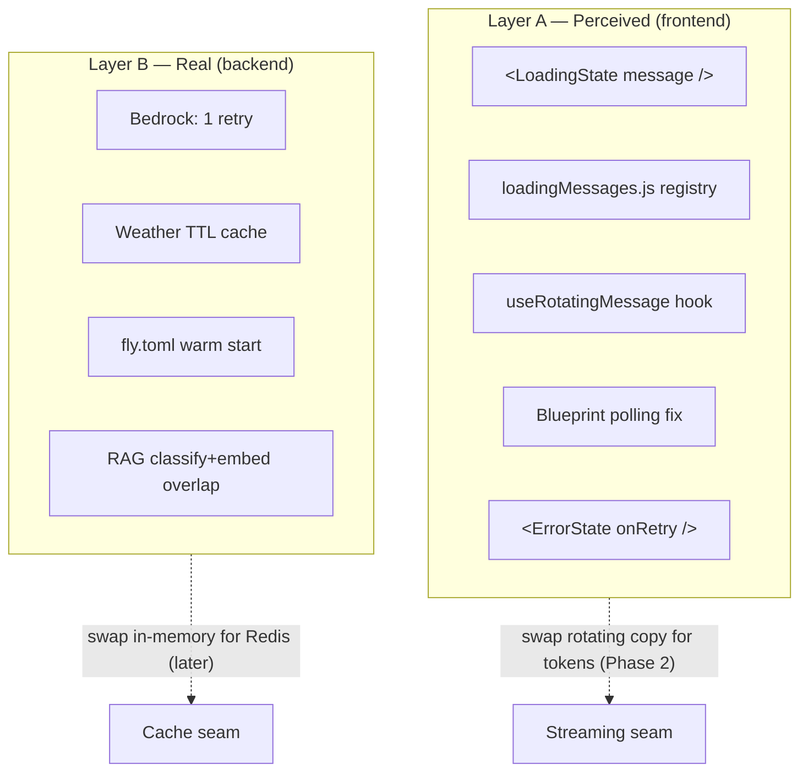
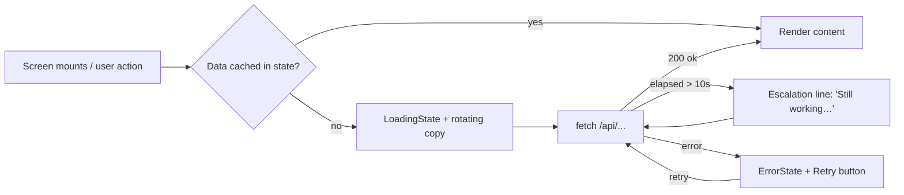
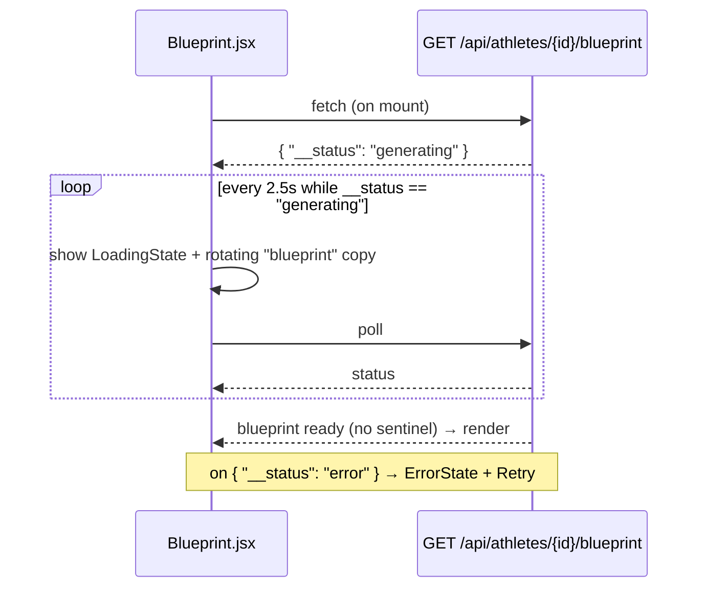
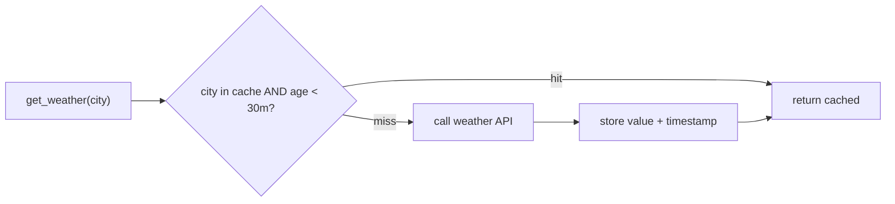
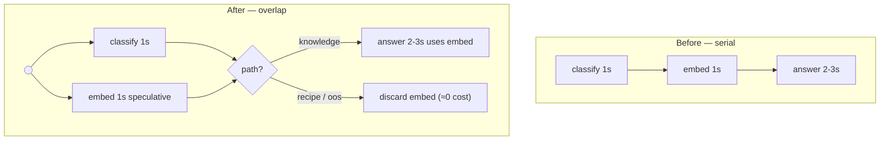

# Smooth Loading + Latency MVP — Design Spec

**Version:** 1.0
**Date:** 2026-06-21
**Status:** For Review
**Author:** Engineering
**Related:** [HLD.md](../../HLD.md) §7 (AI Layer), §8 (AI Coach), §11 (Frontend)

---

## 1. Problem Statement

First-run tester feedback:

> "App looks really sharp and the end result is also impressive, but need to smoothen out the experience, especially when it comes to screens that are processing some logic in the backend and take time to load. They take a long time and no clear message when the screen is trying to load."

Diagnosis from a code audit (`frontend/src/*`, `api/services/*`):

1. **No clear feedback during waits.** There is no shared loading component. Loading copy is inconsistent — some screens show a spinner + text, many show a bare `"Loading…"` string with no motion, and Reports/Recipes only change a button label. A static "Loading…" with no animation reads as *frozen*.
2. **Real latency on AI screens.** The slow surfaces are all AWS Bedrock calls (see §3). The worst is `POST /api/knowledge/ask` at 3–5 s, which runs classify → embed → answer **serially**.
3. **No streaming.** `bedrock_client.py` uses blocking `converse()` / `invoke_model()`. Every AI screen is all-or-nothing — nothing renders until the full response lands.
4. **A real first-run bug.** `Blueprint.jsx` fetches the blueprint **once** and renders an *error* if generation is still in progress. The HLD claims it polls; the code does not. New users hit this on their very first screen.
5. **Cold start.** The Fly.io VM auto-stops when idle; the first request after idle pays a wake cost.
6. **Fail-fast Bedrock.** The client is configured with `max_attempts: 0` — a single transient blip becomes an immediate error to the user.

**This is primarily a *perceived-latency* problem.** The largest, cheapest wins are feedback and the blueprint-polling fix. Real speedups are included where they are low-risk.

---

## 2. Goals & Non-Goals

### Goals
- Every screen shows clear, consistent, moving feedback while a backend call is in flight.
- Slow AI screens (>2 s) show **progressive contextual copy** so the wait feels purposeful.
- Fix the blueprint screen so first-run users see a "generating" state, not an error.
- Make the slow calls genuinely faster where it is cheap and safe.
- Remove the cold-start penalty and add basic resilience (one retry).
- Leave clean seams for a future streaming upgrade — without building it now.

### Non-Goals (this pass)
- **Streaming (SSE) responses.** Biggest chat win, but a real plumbing change. Deferred to Phase 2; §8 documents the seam.
- **Token-budget trimming.** Rejected — truncating large JSON outputs (e.g. the 7-day meal plan) risks a *broken* result. Correctness over a ~30 % latency gain on an unmeasured MVP. Deferred as a measured optimization.
- **Distributed/Redis caching.** In-memory is correct for the single-VM deployment. The cache module is the seam for a later swap.
- **Skeleton-screen placeholders.** Heavier per-screen work than an MVP needs; the shared spinner + rotating copy covers the gap.

---

## 3. Latency Baseline (measured from code audit)

| Endpoint | Sync? | Bedrock round-trips | Wall-clock | Notes |
|---|---|---|---|---|
| `POST /api/knowledge/ask` | sync | 2–3 **serial** | **3–5 s** | classify → embed → answer; worst offender |
| `POST /api/meal-plans/generate` | sync | 1 (large) | **3–5 s** | 2000-token JSON plan |
| `POST /api/meals/analyze-photo` | sync | 1 vision | 2–4 s | vision + USDA FDC lookup |
| `GET /api/analysis/{id}` | sync | 1 | 2–3 s | gap analysis |
| `POST /api/coach/chat` | sync | 1 multi-turn | 2–3 s | + uncached weather (0.5–1 s) |
| `POST /api/meals/analyze-voice` | sync | 1 | 1–2 s | |
| `GET /api/athletes/{id}/fuel-report` | sync | 1 | 1–2 s | |
| `POST /api/athletes/` (blueprint) | **background** | 1 | 0 s wait | already async; returns 201 immediately |
| `GET /api/athletes/{id}/today` | sync | 0 | 0.2–0.5 s | pure compute; fast |

**Already cached:** `blueprint_json` (per athlete), `daily_targets` (per date), `knowledge_chunks.embedding` (per chunk).
**Not cached:** weather (every coach/context call).

---

## 4. Architecture Overview

Two independent layers, shippable separately.



### Core loading flow (applies to every data-fetching screen)



---

## 5. Layer A — Frontend Feedback

### 5.1 `<LoadingState>` component

**File:** `frontend/src/components/LoadingState.jsx` (new)

A single presentational component: spinner + message, centered. Replaces every ad-hoc spinner and bare `"Loading…"` string in the app. One CSS keyframe (`spin`) lives here, removing the duplicated per-screen spinner styles.

**Props:**
- `message: string` — the line to show (caller passes the current rotating value, or a static line).
- `subtle?: boolean` — compact inline variant (for button-adjacent or in-card loads) vs. full-center variant.

**Contract:** purely presentational. No fetching, no timers. What it does: renders a spinner and a message. What it depends on: nothing but its props.

### 5.2 Contextual message registry

**File:** `frontend/src/constants/loadingMessages.js` (new)

A plain map from **task key** → message(s). A single string renders statically; an array is consumed by the rotating hook (§5.3).

```js
export const LOADING_MESSAGES = {
  blueprint:      ["Crunching your numbers…", "Personalizing your plan…", "Almost ready…"],
  photo_analysis: ["Reading your photo…", "Looking up nutrition…", "Almost there…"],
  voice_analysis: ["Listening to your meal…", "Looking up nutrition…"],
  meal_plan_gen:  ["Building your week…", "Matching recipes to your schedule…", "Finishing up…"],
  gap_analysis:   ["Checking today's fuel…", "Comparing to your targets…"],
  coach:          ["Thinking…", "Pulling from trusted sources…"],
  rag_ask:        ["Thinking…", "Pulling from trusted sources…"],
  recipe_swap:    ["Finding a better match…"],
  hydration:      ["Reading the forecast…", "Calculating your sweat plan…"],
  reports:        ["Reviewing the week…", "Writing your summary…"],
  generic:        ["Loading…"],
};
```

**Why a registry:** one place to tune copy; it is the **seam** for Phase-2 streaming — a streamed screen swaps its rotating array for live tokens without touching layout. Messages stay generic-encouraging and **never reference a number, score, grams, or calories** (athlete content rules, HLD §14 / mobile CLAUDE.md §14).

### 5.3 `useRotatingMessage` hook

**File:** `frontend/src/hooks/useRotatingMessage.js` (new)

```
useRotatingMessage(messages: string[], opts?: { intervalMs?: 2500, active?: boolean }) → string
```

Behavior:
- While `active` (a fetch is pending), advances through `messages` every `intervalMs`.
- **Holds on the last message** (does not loop back) — looping implies a stall.
- Resets to index 0 when `active` flips false.
- A single-element array (or a plain string) is returned as-is with no timer.

Pure React (`useState` + `useEffect` + `setInterval`); no dependencies. Independently unit-testable with fake timers.

### 5.4 Blueprint polling fix (highest-value first-run fix)

**File:** `frontend/src/Blueprint.jsx` (modify)

Current code fetches once and shows an error if generation is mid-flight. New behavior:



- Poll interval **2.5 s**, hard cap **40 s** (after which show ErrorState with Retry — does not poll forever).
- Backend already emits the `{"__status": "generating", ...}` and `{"__status": "error", ...}` sentinels — **no backend change required.**
- This is the single most impactful first-run change: a new user's very first screen.

### 5.5 `<ErrorState>` component

**File:** `frontend/src/components/ErrorState.jsx` (new)

Spinner's failure twin: a short friendly line + a **Retry** button (`onRetry` callback). Wired into the screens that currently swallow errors in a silent `.catch()` — **Today**, **HomeScreen**, **Recipes** — so a failed call becomes a recoverable state instead of an indefinite blank.

### 5.6 Wiring into screens

Each data-fetching screen: import `<LoadingState>`, pick a registry key, drive copy with `useRotatingMessage` on the slow ones (>2 s), and render `<ErrorState>` on failure. Screens and their keys:

| Screen | Key | Rotating? |
|---|---|---|
| `Blueprint.jsx` | `blueprint` | yes (+ polling) |
| `MealPlannerScreen.jsx` (generate) | `meal_plan_gen` | yes |
| `ReportsScreen.jsx` | `reports` | yes |
| `HydrationScreen.jsx` (calc) | `hydration` | yes |
| `RecipesScreen.jsx` (swap) | `recipe_swap` | no (single line) |
| Photo/voice capture flow | `photo_analysis` / `voice_analysis` | yes |
| Gap analysis view | `gap_analysis` | yes |
| Coach / RAG ask | `coach` / `rag_ask` | yes |
| `HomeScreen.jsx`, `Today.jsx`, `ScheduleScreen.jsx`, others | `generic` | no |

### 5.7 Escalation line

`useRotatingMessage` (or a tiny sibling `useElapsed`) exposes elapsed time; after **10 s** the screen appends a fixed reassurance line — `"Still working — this one takes a few seconds…"`. Covers the B1 retry tail (§6.1) so even a retried call stays communicative.

---

## 6. Layer B — Backend Latency

### 6.1 One retry on Bedrock

**File:** `api/services/bedrock_client.py` (modify)

Current: `retries={"max_attempts": 0}` (fail-fast). Change to **standard retry mode with one retry** (transient errors only — throttling, 5xx, connection timeouts):

```python
config = Config(
    read_timeout=30,
    connect_timeout=10,
    retries={"max_attempts": 2, "mode": "standard"},  # 1 initial + 1 retry
)
```

> **Implementer note — verify semantics.** In botocore *standard*/*adaptive* mode, `max_attempts` is the **total** attempt count, so `2` = one retry. Confirm against the installed botocore version before merging; the intent is exactly **one** retry on transient failures, not legacy-mode behavior.

**Tradeoff (accepted):** a retry can extend the tail of a bad call. Mitigated by the §5.7 escalation copy. Standard mode does **not** retry a slow-but-successful call, so the common case is unaffected.

### 6.2 Weather TTL cache

**File:** `api/services/weather.py` (modify) — or a thin `weather_cache` helper alongside it.

`get_weather(city)` currently calls the external API on every coach/context request (+0.5–1 s). Add a module-level in-memory cache keyed by normalized city with a **30-minute TTL**:



- Per-process dict; correct for the single-VM deployment. Lost on restart — acceptable (re-warms on first call).
- **Seam:** the helper's interface (`get`/`set` by key+ttl) is what a future Redis backing swaps into.

### 6.3 Warm start (remove cold-start penalty)

**File:** `fly.toml` (modify)

The current `[http_service]` block already has `auto_stop_machines = 'stop'`, `auto_start_machines = true`, and `min_machines_running = 0`. The change is a **single line** — keep one machine always running:

```toml
[http_service]
  auto_stop_machines = 'stop'
  auto_start_machines = true
  min_machines_running = 1   # was 0
```

First-touch after idle no longer pays the wake cost observed during deploys. **Cost note:** one always-on machine carries a small ongoing Fly.io charge (approved).

### 6.4 RAG classify + embed overlap

**File:** `api/services/knowledge/answer.py` (modify)

`answer_with_knowledge()` runs **classify → embed → answer** serially. `classify` and `embed` both depend only on the question, so they can run **concurrently**, saving ~1 s on the common knowledge path.



- Both Bedrock calls are blocking boto3 in a sync route → run them via a `ThreadPoolExecutor` (or `concurrent.futures`), join, then branch on the classifier result.
- **Cost:** one speculative embed (~fractions of a cent) is wasted on `recipe` / `out_of_scope` paths. Net win on the dominant `knowledge` path.
- **This is the only non-trivial backend change.** It is cleanly droppable — B1–B3 stand alone if we want a leaner pass.
- **Invariant preserved:** output is identical to the serial version; only timing changes. Covered by a regression test (§9).

---

## 7. Error Handling

| Layer | Failure | Behavior |
|---|---|---|
| Frontend | fetch rejects / non-200 | `<ErrorState onRetry>` replaces the spinner; Retry re-runs the same fetch. No more silent `.catch()` blanks on Today / HomeScreen / Recipes. |
| Frontend | blueprint still generating after 40 s cap | Stop polling, show ErrorState + Retry (re-polls). |
| Backend | transient Bedrock error | One automatic retry (§6.1); if it still fails, the existing error path returns and the frontend shows ErrorState. |
| Backend | weather API down | Cache miss falls through to existing `get_weather` failure handling; coach proceeds without the heat-advisory block (unchanged behavior). |

No new global error surfaces are introduced; this formalizes feedback the screens already half-had.

---

## 8. Phase 2 Seam — Streaming (NOT built now)

The biggest chat win is streaming `coach/chat` and `knowledge/ask` token-by-token. Why it's deferred and how this design stays ready:

- **Backend:** add a `converse_stream()` wrapper to `bedrock_client.py` (Bedrock supports `converse_stream` / `invoke_model_with_response_stream`) and expose an SSE endpoint. Out of scope now.
- **Frontend seam:** the slow screens already isolate their "waiting" UI behind the `loadingMessages` registry + `useRotatingMessage`. A streamed screen swaps the rotating array for an incremental token buffer — **the layout, the LoadingState mount point, and the error handling all stay.**
- No work in this pass blocks or pre-judges that upgrade.

---

## 9. Testing Strategy

Proportionate to an MVP — test the logic, not the pixels.

| Unit | Test | Type |
|---|---|---|
| `useRotatingMessage` | advances on interval; holds on last; resets when inactive; single-item no-ops | frontend, fake timers |
| `Blueprint.jsx` polling | polls while `generating`; stops on ready; stops + ErrorState on cap/error | frontend, mocked fetch |
| Weather cache | hit within TTL returns cached (no 2nd API call); miss after TTL refetches | backend |
| Bedrock retry config | client config asserts `max_attempts == 2`, `mode == "standard"` | backend |
| RAG overlap | output identical to serial baseline for a fixed question; both calls issued | backend |
| `<LoadingState>` / `<ErrorState>` | render message; Retry fires `onRetry` | frontend, light render test |

---

## 10. Rollout & Risk

- **Order:** Layer A first (pure UX, zero backend risk, ships the felt improvement) → Layer B (B1/B2/B3 trivial; B4 last as the only moderate change).
- **In-memory caches** reset on deploy/restart — documented, acceptable for MVP.
- **B4** is the lone concurrency change; isolated to one route and droppable.
- **Athlete content rule:** rotating copy is generic-encouraging and references no numbers/scores/macros (HLD §14).
- **DB:** no schema changes. No migration required.

---

## 11. Summary of Changes

**New files (frontend):**
- `components/LoadingState.jsx`, `components/ErrorState.jsx`
- `constants/loadingMessages.js`
- `hooks/useRotatingMessage.js`

**Modified (frontend):** `Blueprint.jsx` (polling), `MealPlannerScreen.jsx`, `ReportsScreen.jsx`, `HydrationScreen.jsx`, `RecipesScreen.jsx`, `HomeScreen.jsx`, `Today.jsx`, capture/coach screens — wire in the shared components.

**Modified (backend):** `bedrock_client.py` (retry), `weather.py` (cache), `knowledge/answer.py` (overlap).

**Modified (infra):** `fly.toml` (warm start).

**Explicitly excluded:** streaming, token trimming, Redis, skeleton screens.

---

*All claims in this spec are derived from the FuelUpYouth codebase as of 2026-06-21 and the HLD v1.2.*
